Imported the libraries to preprocess and clean the data


```python
import pandas as pd
import numpy as np
import seaborn as sns
import matplotlib.pyplot as plt
import plotly.express as px
```

Import the data


```python
data = pd.read_csv("/content/drive/MyDrive/Electric_Vehicle_Population_Data.csv")
```

Find out the null and non-null count over all the columns


```python
data.info()
```

    <class 'pandas.core.frame.DataFrame'>
    RangeIndex: 112634 entries, 0 to 112633
    Data columns (total 17 columns):
     #   Column                                             Non-Null Count   Dtype  
    ---  ------                                             --------------   -----  
     0   VIN (1-10)                                         112634 non-null  object 
     1   County                                             112634 non-null  object 
     2   City                                               112634 non-null  object 
     3   State                                              112634 non-null  object 
     4   Postal Code                                        112634 non-null  int64  
     5   Model Year                                         112634 non-null  int64  
     6   Make                                               112634 non-null  object 
     7   Model                                              112614 non-null  object 
     8   Electric Vehicle Type                              112634 non-null  object 
     9   Clean Alternative Fuel Vehicle (CAFV) Eligibility  112634 non-null  object 
     10  Electric Range                                     112634 non-null  int64  
     11  Base MSRP                                          112634 non-null  int64  
     12  Legislative District                               112348 non-null  float64
     13  DOL Vehicle ID                                     112634 non-null  int64  
     14  Vehicle Location                                   112610 non-null  object 
     15  Electric Utility                                   112191 non-null  object 
     16  2020 Census Tract                                  112634 non-null  int64  
    dtypes: float64(1), int64(6), object(10)
    memory usage: 14.6+ MB
    


```python
data.head()
```


  <div id="df-35ec04c3-8919-409d-8f61-ab70e56aaa4f">
    <div class="colab-df-container">
      <div>
<style scoped>
    .dataframe tbody tr th:only-of-type {
        vertical-align: middle;
    }

    .dataframe tbody tr th {
        vertical-align: top;
    }

    .dataframe thead th {
        text-align: right;
    }
</style>
<table border="1" class="dataframe">
  <thead>
    <tr style="text-align: right;">
      <th></th>
      <th>VIN (1-10)</th>
      <th>County</th>
      <th>City</th>
      <th>State</th>
      <th>Postal Code</th>
      <th>Model Year</th>
      <th>Make</th>
      <th>Model</th>
      <th>Electric Vehicle Type</th>
      <th>Clean Alternative Fuel Vehicle (CAFV) Eligibility</th>
      <th>Electric Range</th>
      <th>Base MSRP</th>
      <th>Legislative District</th>
      <th>DOL Vehicle ID</th>
      <th>Vehicle Location</th>
      <th>Electric Utility</th>
      <th>2020 Census Tract</th>
    </tr>
  </thead>
  <tbody>
    <tr>
      <th>0</th>
      <td>JTMEB3FV6N</td>
      <td>Monroe</td>
      <td>Key West</td>
      <td>FL</td>
      <td>33040</td>
      <td>2022</td>
      <td>TOYOTA</td>
      <td>RAV4 PRIME</td>
      <td>Plug-in Hybrid Electric Vehicle (PHEV)</td>
      <td>Clean Alternative Fuel Vehicle Eligible</td>
      <td>42</td>
      <td>0</td>
      <td>NaN</td>
      <td>198968248</td>
      <td>POINT (-81.80023 24.5545)</td>
      <td>NaN</td>
      <td>12087972100</td>
    </tr>
    <tr>
      <th>1</th>
      <td>1G1RD6E45D</td>
      <td>Clark</td>
      <td>Laughlin</td>
      <td>NV</td>
      <td>89029</td>
      <td>2013</td>
      <td>CHEVROLET</td>
      <td>VOLT</td>
      <td>Plug-in Hybrid Electric Vehicle (PHEV)</td>
      <td>Clean Alternative Fuel Vehicle Eligible</td>
      <td>38</td>
      <td>0</td>
      <td>NaN</td>
      <td>5204412</td>
      <td>POINT (-114.57245 35.16815)</td>
      <td>NaN</td>
      <td>32003005702</td>
    </tr>
    <tr>
      <th>2</th>
      <td>JN1AZ0CP8B</td>
      <td>Yakima</td>
      <td>Yakima</td>
      <td>WA</td>
      <td>98901</td>
      <td>2011</td>
      <td>NISSAN</td>
      <td>LEAF</td>
      <td>Battery Electric Vehicle (BEV)</td>
      <td>Clean Alternative Fuel Vehicle Eligible</td>
      <td>73</td>
      <td>0</td>
      <td>15.0</td>
      <td>218972519</td>
      <td>POINT (-120.50721 46.60448)</td>
      <td>PACIFICORP</td>
      <td>53077001602</td>
    </tr>
    <tr>
      <th>3</th>
      <td>1G1FW6S08H</td>
      <td>Skagit</td>
      <td>Concrete</td>
      <td>WA</td>
      <td>98237</td>
      <td>2017</td>
      <td>CHEVROLET</td>
      <td>BOLT EV</td>
      <td>Battery Electric Vehicle (BEV)</td>
      <td>Clean Alternative Fuel Vehicle Eligible</td>
      <td>238</td>
      <td>0</td>
      <td>39.0</td>
      <td>186750406</td>
      <td>POINT (-121.7515 48.53892)</td>
      <td>PUGET SOUND ENERGY INC</td>
      <td>53057951101</td>
    </tr>
    <tr>
      <th>4</th>
      <td>3FA6P0SU1K</td>
      <td>Snohomish</td>
      <td>Everett</td>
      <td>WA</td>
      <td>98201</td>
      <td>2019</td>
      <td>FORD</td>
      <td>FUSION</td>
      <td>Plug-in Hybrid Electric Vehicle (PHEV)</td>
      <td>Not eligible due to low battery range</td>
      <td>26</td>
      <td>0</td>
      <td>38.0</td>
      <td>2006714</td>
      <td>POINT (-122.20596 47.97659)</td>
      <td>PUGET SOUND ENERGY INC</td>
      <td>53061041500</td>
    </tr>
  </tbody>
</table>
</div>
      <button class="colab-df-convert" onclick="convertToInteractive('df-35ec04c3-8919-409d-8f61-ab70e56aaa4f')"
              title="Convert this dataframe to an interactive table."
              style="display:none;">

  <svg xmlns="http://www.w3.org/2000/svg" height="24px"viewBox="0 0 24 24"
       width="24px">
    <path d="M0 0h24v24H0V0z" fill="none"/>
    <path d="M18.56 5.44l.94 2.06.94-2.06 2.06-.94-2.06-.94-.94-2.06-.94 2.06-2.06.94zm-11 1L8.5 8.5l.94-2.06 2.06-.94-2.06-.94L8.5 2.5l-.94 2.06-2.06.94zm10 10l.94 2.06.94-2.06 2.06-.94-2.06-.94-.94-2.06-.94 2.06-2.06.94z"/><path d="M17.41 7.96l-1.37-1.37c-.4-.4-.92-.59-1.43-.59-.52 0-1.04.2-1.43.59L10.3 9.45l-7.72 7.72c-.78.78-.78 2.05 0 2.83L4 21.41c.39.39.9.59 1.41.59.51 0 1.02-.2 1.41-.59l7.78-7.78 2.81-2.81c.8-.78.8-2.07 0-2.86zM5.41 20L4 18.59l7.72-7.72 1.47 1.35L5.41 20z"/>
  </svg>
      </button>

  <style>
    .colab-df-container {
      display:flex;
      flex-wrap:wrap;
      gap: 12px;
    }

    .colab-df-convert {
      background-color: #E8F0FE;
      border: none;
      border-radius: 50%;
      cursor: pointer;
      display: none;
      fill: #1967D2;
      height: 32px;
      padding: 0 0 0 0;
      width: 32px;
    }

    .colab-df-convert:hover {
      background-color: #E2EBFA;
      box-shadow: 0px 1px 2px rgba(60, 64, 67, 0.3), 0px 1px 3px 1px rgba(60, 64, 67, 0.15);
      fill: #174EA6;
    }

    [theme=dark] .colab-df-convert {
      background-color: #3B4455;
      fill: #D2E3FC;
    }

    [theme=dark] .colab-df-convert:hover {
      background-color: #434B5C;
      box-shadow: 0px 1px 3px 1px rgba(0, 0, 0, 0.15);
      filter: drop-shadow(0px 1px 2px rgba(0, 0, 0, 0.3));
      fill: #FFFFFF;
    }
  </style>

      <script>
        const buttonEl =
          document.querySelector('#df-35ec04c3-8919-409d-8f61-ab70e56aaa4f button.colab-df-convert');
        buttonEl.style.display =
          google.colab.kernel.accessAllowed ? 'block' : 'none';

        async function convertToInteractive(key) {
          const element = document.querySelector('#df-35ec04c3-8919-409d-8f61-ab70e56aaa4f');
          const dataTable =
            await google.colab.kernel.invokeFunction('convertToInteractive',
                                                     [key], {});
          if (!dataTable) return;

          const docLinkHtml = 'Like what you see? Visit the ' +
            '<a target="_blank" href=https://colab.research.google.com/notebooks/data_table.ipynb>data table notebook</a>'
            + ' to learn more about interactive tables.';
          element.innerHTML = '';
          dataTable['output_type'] = 'display_data';
          await google.colab.output.renderOutput(dataTable, element);
          const docLink = document.createElement('div');
          docLink.innerHTML = docLinkHtml;
          element.appendChild(docLink);
        }
      </script>
    </div>
  </div>


Drop the unwanted columns from the data in order to avoid mess


```python
data.drop(['VIN (1-10)','Postal Code','Base MSRP','Legislative District','DOL Vehicle ID','Electric Utility','2020 Census Tract'],axis=1,inplace=True)
```


```python
data.head()
```


  <div id="df-760424cb-2c51-4b7f-98c5-9063d12fd8f0">
    <div class="colab-df-container">
      <div>
<style scoped>
    .dataframe tbody tr th:only-of-type {
        vertical-align: middle;
    }

    .dataframe tbody tr th {
        vertical-align: top;
    }

    .dataframe thead th {
        text-align: right;
    }
</style>
<table border="1" class="dataframe">
  <thead>
    <tr style="text-align: right;">
      <th></th>
      <th>County</th>
      <th>City</th>
      <th>State</th>
      <th>Model Year</th>
      <th>Make</th>
      <th>Model</th>
      <th>Electric Vehicle Type</th>
      <th>Clean Alternative Fuel Vehicle (CAFV) Eligibility</th>
      <th>Electric Range</th>
      <th>Vehicle Location</th>
    </tr>
  </thead>
  <tbody>
    <tr>
      <th>0</th>
      <td>Monroe</td>
      <td>Key West</td>
      <td>FL</td>
      <td>2022</td>
      <td>TOYOTA</td>
      <td>RAV4 PRIME</td>
      <td>Plug-in Hybrid Electric Vehicle (PHEV)</td>
      <td>Clean Alternative Fuel Vehicle Eligible</td>
      <td>42</td>
      <td>POINT (-81.80023 24.5545)</td>
    </tr>
    <tr>
      <th>1</th>
      <td>Clark</td>
      <td>Laughlin</td>
      <td>NV</td>
      <td>2013</td>
      <td>CHEVROLET</td>
      <td>VOLT</td>
      <td>Plug-in Hybrid Electric Vehicle (PHEV)</td>
      <td>Clean Alternative Fuel Vehicle Eligible</td>
      <td>38</td>
      <td>POINT (-114.57245 35.16815)</td>
    </tr>
    <tr>
      <th>2</th>
      <td>Yakima</td>
      <td>Yakima</td>
      <td>WA</td>
      <td>2011</td>
      <td>NISSAN</td>
      <td>LEAF</td>
      <td>Battery Electric Vehicle (BEV)</td>
      <td>Clean Alternative Fuel Vehicle Eligible</td>
      <td>73</td>
      <td>POINT (-120.50721 46.60448)</td>
    </tr>
    <tr>
      <th>3</th>
      <td>Skagit</td>
      <td>Concrete</td>
      <td>WA</td>
      <td>2017</td>
      <td>CHEVROLET</td>
      <td>BOLT EV</td>
      <td>Battery Electric Vehicle (BEV)</td>
      <td>Clean Alternative Fuel Vehicle Eligible</td>
      <td>238</td>
      <td>POINT (-121.7515 48.53892)</td>
    </tr>
    <tr>
      <th>4</th>
      <td>Snohomish</td>
      <td>Everett</td>
      <td>WA</td>
      <td>2019</td>
      <td>FORD</td>
      <td>FUSION</td>
      <td>Plug-in Hybrid Electric Vehicle (PHEV)</td>
      <td>Not eligible due to low battery range</td>
      <td>26</td>
      <td>POINT (-122.20596 47.97659)</td>
    </tr>
  </tbody>
</table>
</div>
      <button class="colab-df-convert" onclick="convertToInteractive('df-760424cb-2c51-4b7f-98c5-9063d12fd8f0')"
              title="Convert this dataframe to an interactive table."
              style="display:none;">

  <svg xmlns="http://www.w3.org/2000/svg" height="24px"viewBox="0 0 24 24"
       width="24px">
    <path d="M0 0h24v24H0V0z" fill="none"/>
    <path d="M18.56 5.44l.94 2.06.94-2.06 2.06-.94-2.06-.94-.94-2.06-.94 2.06-2.06.94zm-11 1L8.5 8.5l.94-2.06 2.06-.94-2.06-.94L8.5 2.5l-.94 2.06-2.06.94zm10 10l.94 2.06.94-2.06 2.06-.94-2.06-.94-.94-2.06-.94 2.06-2.06.94z"/><path d="M17.41 7.96l-1.37-1.37c-.4-.4-.92-.59-1.43-.59-.52 0-1.04.2-1.43.59L10.3 9.45l-7.72 7.72c-.78.78-.78 2.05 0 2.83L4 21.41c.39.39.9.59 1.41.59.51 0 1.02-.2 1.41-.59l7.78-7.78 2.81-2.81c.8-.78.8-2.07 0-2.86zM5.41 20L4 18.59l7.72-7.72 1.47 1.35L5.41 20z"/>
  </svg>
      </button>

  <style>
    .colab-df-container {
      display:flex;
      flex-wrap:wrap;
      gap: 12px;
    }

    .colab-df-convert {
      background-color: #E8F0FE;
      border: none;
      border-radius: 50%;
      cursor: pointer;
      display: none;
      fill: #1967D2;
      height: 32px;
      padding: 0 0 0 0;
      width: 32px;
    }

    .colab-df-convert:hover {
      background-color: #E2EBFA;
      box-shadow: 0px 1px 2px rgba(60, 64, 67, 0.3), 0px 1px 3px 1px rgba(60, 64, 67, 0.15);
      fill: #174EA6;
    }

    [theme=dark] .colab-df-convert {
      background-color: #3B4455;
      fill: #D2E3FC;
    }

    [theme=dark] .colab-df-convert:hover {
      background-color: #434B5C;
      box-shadow: 0px 1px 3px 1px rgba(0, 0, 0, 0.15);
      filter: drop-shadow(0px 1px 2px rgba(0, 0, 0, 0.3));
      fill: #FFFFFF;
    }
  </style>

      <script>
        const buttonEl =
          document.querySelector('#df-760424cb-2c51-4b7f-98c5-9063d12fd8f0 button.colab-df-convert');
        buttonEl.style.display =
          google.colab.kernel.accessAllowed ? 'block' : 'none';

        async function convertToInteractive(key) {
          const element = document.querySelector('#df-760424cb-2c51-4b7f-98c5-9063d12fd8f0');
          const dataTable =
            await google.colab.kernel.invokeFunction('convertToInteractive',
                                                     [key], {});
          if (!dataTable) return;

          const docLinkHtml = 'Like what you see? Visit the ' +
            '<a target="_blank" href=https://colab.research.google.com/notebooks/data_table.ipynb>data table notebook</a>'
            + ' to learn more about interactive tables.';
          element.innerHTML = '';
          dataTable['output_type'] = 'display_data';
          await google.colab.output.renderOutput(dataTable, element);
          const docLink = document.createElement('div');
          docLink.innerHTML = docLinkHtml;
          element.appendChild(docLink);
        }
      </script>
    </div>
  </div>


Dimensions of the data


```python
data.shape
```


    (112634, 10)


To observe the null values present in the data


```python
data.isna().sum()
```


    County                                                0
    City                                                  0
    State                                                 0
    Model Year                                            0
    Make                                                  0
    Model                                                20
    Electric Vehicle Type                                 0
    Clean Alternative Fuel Vehicle (CAFV) Eligibility     0
    Electric Range                                        0
    Vehicle Location                                     24
    dtype: int64


Dropping the null values by using dropna function


```python
data = data.dropna()
```

 # Checking from which county we have more entries from (Top 10)


```python


Counties = data.groupby('County').count().sort_values(by='City',ascending=False)['City'].index
values = data.groupby('County').count().sort_values(by='City',ascending=False)['City'].values

px.bar(x=list(Counties)[:10],y=values[:10],labels={'x':"County Name",'y':"Number of Cars"},color=values[:10])
```


<html>
<head><meta charset="utf-8" /></head>
<body>
    <div>            <script src="https://cdnjs.cloudflare.com/ajax/libs/mathjax/2.7.5/MathJax.js?config=TeX-AMS-MML_SVG"></script><script type="text/javascript">if (window.MathJax && window.MathJax.Hub && window.MathJax.Hub.Config) {window.MathJax.Hub.Config({SVG: {font: "STIX-Web"}});}</script>                <script type="text/javascript">window.PlotlyConfig = {MathJaxConfig: 'local'};</script>
        <script src="https://cdn.plot.ly/plotly-2.18.2.min.js"></script>                <div id="8d519779-7760-4220-9fc2-e01715f8cfdd" class="plotly-graph-div" style="height:525px; width:100%;"></div>            <script type="text/javascript">                                    window.PLOTLYENV=window.PLOTLYENV || {};                                    if (document.getElementById("8d519779-7760-4220-9fc2-e01715f8cfdd")) {                    Plotly.newPlot(                        "8d519779-7760-4220-9fc2-e01715f8cfdd",                        [{"alignmentgroup":"True","hovertemplate":"County Name=%{x}<br>Number of Cars=%{y}<br>color=%{marker.color}<extra></extra>","legendgroup":"","marker":{"color":[58981,12432,8525,6689,4124,3845,2839,2792,1376,1307],"coloraxis":"coloraxis","pattern":{"shape":""}},"name":"","offsetgroup":"","orientation":"v","showlegend":false,"textposition":"auto","x":["King","Snohomish","Pierce","Clark","Thurston","Kitsap","Whatcom","Spokane","Benton","Island"],"xaxis":"x","y":[58981,12432,8525,6689,4124,3845,2839,2792,1376,1307],"yaxis":"y","type":"bar"}],                        {"template":{"data":{"histogram2dcontour":[{"type":"histogram2dcontour","colorbar":{"outlinewidth":0,"ticks":""},"colorscale":[[0.0,"#0d0887"],[0.1111111111111111,"#46039f"],[0.2222222222222222,"#7201a8"],[0.3333333333333333,"#9c179e"],[0.4444444444444444,"#bd3786"],[0.5555555555555556,"#d8576b"],[0.6666666666666666,"#ed7953"],[0.7777777777777778,"#fb9f3a"],[0.8888888888888888,"#fdca26"],[1.0,"#f0f921"]]}],"choropleth":[{"type":"choropleth","colorbar":{"outlinewidth":0,"ticks":""}}],"histogram2d":[{"type":"histogram2d","colorbar":{"outlinewidth":0,"ticks":""},"colorscale":[[0.0,"#0d0887"],[0.1111111111111111,"#46039f"],[0.2222222222222222,"#7201a8"],[0.3333333333333333,"#9c179e"],[0.4444444444444444,"#bd3786"],[0.5555555555555556,"#d8576b"],[0.6666666666666666,"#ed7953"],[0.7777777777777778,"#fb9f3a"],[0.8888888888888888,"#fdca26"],[1.0,"#f0f921"]]}],"heatmap":[{"type":"heatmap","colorbar":{"outlinewidth":0,"ticks":""},"colorscale":[[0.0,"#0d0887"],[0.1111111111111111,"#46039f"],[0.2222222222222222,"#7201a8"],[0.3333333333333333,"#9c179e"],[0.4444444444444444,"#bd3786"],[0.5555555555555556,"#d8576b"],[0.6666666666666666,"#ed7953"],[0.7777777777777778,"#fb9f3a"],[0.8888888888888888,"#fdca26"],[1.0,"#f0f921"]]}],"heatmapgl":[{"type":"heatmapgl","colorbar":{"outlinewidth":0,"ticks":""},"colorscale":[[0.0,"#0d0887"],[0.1111111111111111,"#46039f"],[0.2222222222222222,"#7201a8"],[0.3333333333333333,"#9c179e"],[0.4444444444444444,"#bd3786"],[0.5555555555555556,"#d8576b"],[0.6666666666666666,"#ed7953"],[0.7777777777777778,"#fb9f3a"],[0.8888888888888888,"#fdca26"],[1.0,"#f0f921"]]}],"contourcarpet":[{"type":"contourcarpet","colorbar":{"outlinewidth":0,"ticks":""}}],"contour":[{"type":"contour","colorbar":{"outlinewidth":0,"ticks":""},"colorscale":[[0.0,"#0d0887"],[0.1111111111111111,"#46039f"],[0.2222222222222222,"#7201a8"],[0.3333333333333333,"#9c179e"],[0.4444444444444444,"#bd3786"],[0.5555555555555556,"#d8576b"],[0.6666666666666666,"#ed7953"],[0.7777777777777778,"#fb9f3a"],[0.8888888888888888,"#fdca26"],[1.0,"#f0f921"]]}],"surface":[{"type":"surface","colorbar":{"outlinewidth":0,"ticks":""},"colorscale":[[0.0,"#0d0887"],[0.1111111111111111,"#46039f"],[0.2222222222222222,"#7201a8"],[0.3333333333333333,"#9c179e"],[0.4444444444444444,"#bd3786"],[0.5555555555555556,"#d8576b"],[0.6666666666666666,"#ed7953"],[0.7777777777777778,"#fb9f3a"],[0.8888888888888888,"#fdca26"],[1.0,"#f0f921"]]}],"mesh3d":[{"type":"mesh3d","colorbar":{"outlinewidth":0,"ticks":""}}],"scatter":[{"fillpattern":{"fillmode":"overlay","size":10,"solidity":0.2},"type":"scatter"}],"parcoords":[{"type":"parcoords","line":{"colorbar":{"outlinewidth":0,"ticks":""}}}],"scatterpolargl":[{"type":"scatterpolargl","marker":{"colorbar":{"outlinewidth":0,"ticks":""}}}],"bar":[{"error_x":{"color":"#2a3f5f"},"error_y":{"color":"#2a3f5f"},"marker":{"line":{"color":"#E5ECF6","width":0.5},"pattern":{"fillmode":"overlay","size":10,"solidity":0.2}},"type":"bar"}],"scattergeo":[{"type":"scattergeo","marker":{"colorbar":{"outlinewidth":0,"ticks":""}}}],"scatterpolar":[{"type":"scatterpolar","marker":{"colorbar":{"outlinewidth":0,"ticks":""}}}],"histogram":[{"marker":{"pattern":{"fillmode":"overlay","size":10,"solidity":0.2}},"type":"histogram"}],"scattergl":[{"type":"scattergl","marker":{"colorbar":{"outlinewidth":0,"ticks":""}}}],"scatter3d":[{"type":"scatter3d","line":{"colorbar":{"outlinewidth":0,"ticks":""}},"marker":{"colorbar":{"outlinewidth":0,"ticks":""}}}],"scattermapbox":[{"type":"scattermapbox","marker":{"colorbar":{"outlinewidth":0,"ticks":""}}}],"scatterternary":[{"type":"scatterternary","marker":{"colorbar":{"outlinewidth":0,"ticks":""}}}],"scattercarpet":[{"type":"scattercarpet","marker":{"colorbar":{"outlinewidth":0,"ticks":""}}}],"carpet":[{"aaxis":{"endlinecolor":"#2a3f5f","gridcolor":"white","linecolor":"white","minorgridcolor":"white","startlinecolor":"#2a3f5f"},"baxis":{"endlinecolor":"#2a3f5f","gridcolor":"white","linecolor":"white","minorgridcolor":"white","startlinecolor":"#2a3f5f"},"type":"carpet"}],"table":[{"cells":{"fill":{"color":"#EBF0F8"},"line":{"color":"white"}},"header":{"fill":{"color":"#C8D4E3"},"line":{"color":"white"}},"type":"table"}],"barpolar":[{"marker":{"line":{"color":"#E5ECF6","width":0.5},"pattern":{"fillmode":"overlay","size":10,"solidity":0.2}},"type":"barpolar"}],"pie":[{"automargin":true,"type":"pie"}]},"layout":{"autotypenumbers":"strict","colorway":["#636efa","#EF553B","#00cc96","#ab63fa","#FFA15A","#19d3f3","#FF6692","#B6E880","#FF97FF","#FECB52"],"font":{"color":"#2a3f5f"},"hovermode":"closest","hoverlabel":{"align":"left"},"paper_bgcolor":"white","plot_bgcolor":"#E5ECF6","polar":{"bgcolor":"#E5ECF6","angularaxis":{"gridcolor":"white","linecolor":"white","ticks":""},"radialaxis":{"gridcolor":"white","linecolor":"white","ticks":""}},"ternary":{"bgcolor":"#E5ECF6","aaxis":{"gridcolor":"white","linecolor":"white","ticks":""},"baxis":{"gridcolor":"white","linecolor":"white","ticks":""},"caxis":{"gridcolor":"white","linecolor":"white","ticks":""}},"coloraxis":{"colorbar":{"outlinewidth":0,"ticks":""}},"colorscale":{"sequential":[[0.0,"#0d0887"],[0.1111111111111111,"#46039f"],[0.2222222222222222,"#7201a8"],[0.3333333333333333,"#9c179e"],[0.4444444444444444,"#bd3786"],[0.5555555555555556,"#d8576b"],[0.6666666666666666,"#ed7953"],[0.7777777777777778,"#fb9f3a"],[0.8888888888888888,"#fdca26"],[1.0,"#f0f921"]],"sequentialminus":[[0.0,"#0d0887"],[0.1111111111111111,"#46039f"],[0.2222222222222222,"#7201a8"],[0.3333333333333333,"#9c179e"],[0.4444444444444444,"#bd3786"],[0.5555555555555556,"#d8576b"],[0.6666666666666666,"#ed7953"],[0.7777777777777778,"#fb9f3a"],[0.8888888888888888,"#fdca26"],[1.0,"#f0f921"]],"diverging":[[0,"#8e0152"],[0.1,"#c51b7d"],[0.2,"#de77ae"],[0.3,"#f1b6da"],[0.4,"#fde0ef"],[0.5,"#f7f7f7"],[0.6,"#e6f5d0"],[0.7,"#b8e186"],[0.8,"#7fbc41"],[0.9,"#4d9221"],[1,"#276419"]]},"xaxis":{"gridcolor":"white","linecolor":"white","ticks":"","title":{"standoff":15},"zerolinecolor":"white","automargin":true,"zerolinewidth":2},"yaxis":{"gridcolor":"white","linecolor":"white","ticks":"","title":{"standoff":15},"zerolinecolor":"white","automargin":true,"zerolinewidth":2},"scene":{"xaxis":{"backgroundcolor":"#E5ECF6","gridcolor":"white","linecolor":"white","showbackground":true,"ticks":"","zerolinecolor":"white","gridwidth":2},"yaxis":{"backgroundcolor":"#E5ECF6","gridcolor":"white","linecolor":"white","showbackground":true,"ticks":"","zerolinecolor":"white","gridwidth":2},"zaxis":{"backgroundcolor":"#E5ECF6","gridcolor":"white","linecolor":"white","showbackground":true,"ticks":"","zerolinecolor":"white","gridwidth":2}},"shapedefaults":{"line":{"color":"#2a3f5f"}},"annotationdefaults":{"arrowcolor":"#2a3f5f","arrowhead":0,"arrowwidth":1},"geo":{"bgcolor":"white","landcolor":"#E5ECF6","subunitcolor":"white","showland":true,"showlakes":true,"lakecolor":"white"},"title":{"x":0.05},"mapbox":{"style":"light"}}},"xaxis":{"anchor":"y","domain":[0.0,1.0],"title":{"text":"County Name"}},"yaxis":{"anchor":"x","domain":[0.0,1.0],"title":{"text":"Number of Cars"}},"coloraxis":{"colorbar":{"title":{"text":"color"}},"colorscale":[[0.0,"#0d0887"],[0.1111111111111111,"#46039f"],[0.2222222222222222,"#7201a8"],[0.3333333333333333,"#9c179e"],[0.4444444444444444,"#bd3786"],[0.5555555555555556,"#d8576b"],[0.6666666666666666,"#ed7953"],[0.7777777777777778,"#fb9f3a"],[0.8888888888888888,"#fdca26"],[1.0,"#f0f921"]]},"legend":{"tracegroupgap":0},"margin":{"t":60},"barmode":"relative"},                        {"responsive": true}                    ).then(function(){

var gd = document.getElementById('8d519779-7760-4220-9fc2-e01715f8cfdd');
var x = new MutationObserver(function (mutations, observer) {{
        var display = window.getComputedStyle(gd).display;
        if (!display || display === 'none') {{
            console.log([gd, 'removed!']);
            Plotly.purge(gd);
            observer.disconnect();
        }}
}});

// Listen for the removal of the full notebook cells
var notebookContainer = gd.closest('#notebook-container');
if (notebookContainer) {{
    x.observe(notebookContainer, {childList: true});
}}

// Listen for the clearing of the current output cell
var outputEl = gd.closest('.output');
if (outputEl) {{
    x.observe(outputEl, {childList: true});
}}

                        })                };                            </script>        </div>
</body>
</html>


#lets see which company makes most of the electric vehicles


```python
Companies = data.groupby('Make').count().sort_values(by='City',ascending=False)['City'].index
values = data.groupby('Make').count().sort_values(by='City',ascending=False)['City'].values


plt.figure(figsize=(9,5))
sns.barplot(x=list(Companies)[:10],y=values[:10],edgecolor='.2',palette='Set2')
plt.xlabel('Companies')
plt.ylabel('Count')
plt.show()
```


    
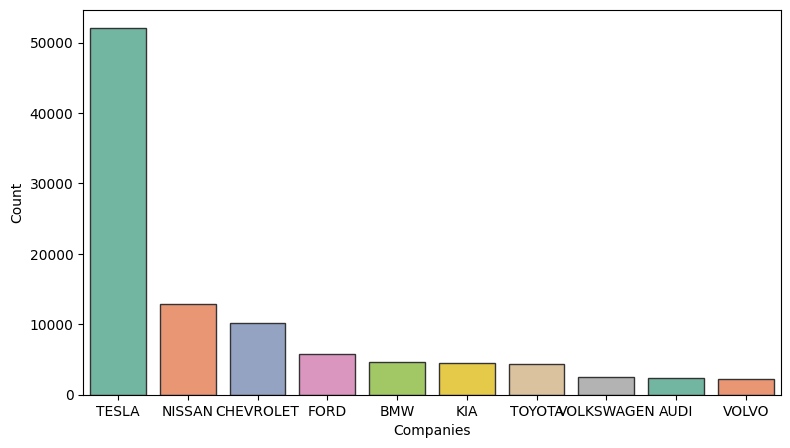
    


# let's see which top 10 cars are been in demand


```python
px.pie(names=list(Companies)[:10],values=values[:10],width=500,height=400)
```


<html>
<head><meta charset="utf-8" /></head>
<body>
    <div>            <script src="https://cdnjs.cloudflare.com/ajax/libs/mathjax/2.7.5/MathJax.js?config=TeX-AMS-MML_SVG"></script><script type="text/javascript">if (window.MathJax && window.MathJax.Hub && window.MathJax.Hub.Config) {window.MathJax.Hub.Config({SVG: {font: "STIX-Web"}});}</script>                <script type="text/javascript">window.PlotlyConfig = {MathJaxConfig: 'local'};</script>
        <script src="https://cdn.plot.ly/plotly-2.18.2.min.js"></script>                <div id="f2df0960-feb4-4b86-afdb-07744f04be61" class="plotly-graph-div" style="height:400px; width:500px;"></div>            <script type="text/javascript">                                    window.PLOTLYENV=window.PLOTLYENV || {};                                    if (document.getElementById("f2df0960-feb4-4b86-afdb-07744f04be61")) {                    Plotly.newPlot(                        "f2df0960-feb4-4b86-afdb-07744f04be61",                        [{"domain":{"x":[0.0,1.0],"y":[0.0,1.0]},"hovertemplate":"label=%{label}<br>value=%{value}<extra></extra>","labels":["TESLA","NISSAN","CHEVROLET","FORD","BMW","KIA","TOYOTA","VOLKSWAGEN","AUDI","VOLVO"],"legendgroup":"","name":"","showlegend":true,"values":[52074,12874,10179,5813,4680,4482,4403,2514,2332,2268],"type":"pie"}],                        {"template":{"data":{"histogram2dcontour":[{"type":"histogram2dcontour","colorbar":{"outlinewidth":0,"ticks":""},"colorscale":[[0.0,"#0d0887"],[0.1111111111111111,"#46039f"],[0.2222222222222222,"#7201a8"],[0.3333333333333333,"#9c179e"],[0.4444444444444444,"#bd3786"],[0.5555555555555556,"#d8576b"],[0.6666666666666666,"#ed7953"],[0.7777777777777778,"#fb9f3a"],[0.8888888888888888,"#fdca26"],[1.0,"#f0f921"]]}],"choropleth":[{"type":"choropleth","colorbar":{"outlinewidth":0,"ticks":""}}],"histogram2d":[{"type":"histogram2d","colorbar":{"outlinewidth":0,"ticks":""},"colorscale":[[0.0,"#0d0887"],[0.1111111111111111,"#46039f"],[0.2222222222222222,"#7201a8"],[0.3333333333333333,"#9c179e"],[0.4444444444444444,"#bd3786"],[0.5555555555555556,"#d8576b"],[0.6666666666666666,"#ed7953"],[0.7777777777777778,"#fb9f3a"],[0.8888888888888888,"#fdca26"],[1.0,"#f0f921"]]}],"heatmap":[{"type":"heatmap","colorbar":{"outlinewidth":0,"ticks":""},"colorscale":[[0.0,"#0d0887"],[0.1111111111111111,"#46039f"],[0.2222222222222222,"#7201a8"],[0.3333333333333333,"#9c179e"],[0.4444444444444444,"#bd3786"],[0.5555555555555556,"#d8576b"],[0.6666666666666666,"#ed7953"],[0.7777777777777778,"#fb9f3a"],[0.8888888888888888,"#fdca26"],[1.0,"#f0f921"]]}],"heatmapgl":[{"type":"heatmapgl","colorbar":{"outlinewidth":0,"ticks":""},"colorscale":[[0.0,"#0d0887"],[0.1111111111111111,"#46039f"],[0.2222222222222222,"#7201a8"],[0.3333333333333333,"#9c179e"],[0.4444444444444444,"#bd3786"],[0.5555555555555556,"#d8576b"],[0.6666666666666666,"#ed7953"],[0.7777777777777778,"#fb9f3a"],[0.8888888888888888,"#fdca26"],[1.0,"#f0f921"]]}],"contourcarpet":[{"type":"contourcarpet","colorbar":{"outlinewidth":0,"ticks":""}}],"contour":[{"type":"contour","colorbar":{"outlinewidth":0,"ticks":""},"colorscale":[[0.0,"#0d0887"],[0.1111111111111111,"#46039f"],[0.2222222222222222,"#7201a8"],[0.3333333333333333,"#9c179e"],[0.4444444444444444,"#bd3786"],[0.5555555555555556,"#d8576b"],[0.6666666666666666,"#ed7953"],[0.7777777777777778,"#fb9f3a"],[0.8888888888888888,"#fdca26"],[1.0,"#f0f921"]]}],"surface":[{"type":"surface","colorbar":{"outlinewidth":0,"ticks":""},"colorscale":[[0.0,"#0d0887"],[0.1111111111111111,"#46039f"],[0.2222222222222222,"#7201a8"],[0.3333333333333333,"#9c179e"],[0.4444444444444444,"#bd3786"],[0.5555555555555556,"#d8576b"],[0.6666666666666666,"#ed7953"],[0.7777777777777778,"#fb9f3a"],[0.8888888888888888,"#fdca26"],[1.0,"#f0f921"]]}],"mesh3d":[{"type":"mesh3d","colorbar":{"outlinewidth":0,"ticks":""}}],"scatter":[{"fillpattern":{"fillmode":"overlay","size":10,"solidity":0.2},"type":"scatter"}],"parcoords":[{"type":"parcoords","line":{"colorbar":{"outlinewidth":0,"ticks":""}}}],"scatterpolargl":[{"type":"scatterpolargl","marker":{"colorbar":{"outlinewidth":0,"ticks":""}}}],"bar":[{"error_x":{"color":"#2a3f5f"},"error_y":{"color":"#2a3f5f"},"marker":{"line":{"color":"#E5ECF6","width":0.5},"pattern":{"fillmode":"overlay","size":10,"solidity":0.2}},"type":"bar"}],"scattergeo":[{"type":"scattergeo","marker":{"colorbar":{"outlinewidth":0,"ticks":""}}}],"scatterpolar":[{"type":"scatterpolar","marker":{"colorbar":{"outlinewidth":0,"ticks":""}}}],"histogram":[{"marker":{"pattern":{"fillmode":"overlay","size":10,"solidity":0.2}},"type":"histogram"}],"scattergl":[{"type":"scattergl","marker":{"colorbar":{"outlinewidth":0,"ticks":""}}}],"scatter3d":[{"type":"scatter3d","line":{"colorbar":{"outlinewidth":0,"ticks":""}},"marker":{"colorbar":{"outlinewidth":0,"ticks":""}}}],"scattermapbox":[{"type":"scattermapbox","marker":{"colorbar":{"outlinewidth":0,"ticks":""}}}],"scatterternary":[{"type":"scatterternary","marker":{"colorbar":{"outlinewidth":0,"ticks":""}}}],"scattercarpet":[{"type":"scattercarpet","marker":{"colorbar":{"outlinewidth":0,"ticks":""}}}],"carpet":[{"aaxis":{"endlinecolor":"#2a3f5f","gridcolor":"white","linecolor":"white","minorgridcolor":"white","startlinecolor":"#2a3f5f"},"baxis":{"endlinecolor":"#2a3f5f","gridcolor":"white","linecolor":"white","minorgridcolor":"white","startlinecolor":"#2a3f5f"},"type":"carpet"}],"table":[{"cells":{"fill":{"color":"#EBF0F8"},"line":{"color":"white"}},"header":{"fill":{"color":"#C8D4E3"},"line":{"color":"white"}},"type":"table"}],"barpolar":[{"marker":{"line":{"color":"#E5ECF6","width":0.5},"pattern":{"fillmode":"overlay","size":10,"solidity":0.2}},"type":"barpolar"}],"pie":[{"automargin":true,"type":"pie"}]},"layout":{"autotypenumbers":"strict","colorway":["#636efa","#EF553B","#00cc96","#ab63fa","#FFA15A","#19d3f3","#FF6692","#B6E880","#FF97FF","#FECB52"],"font":{"color":"#2a3f5f"},"hovermode":"closest","hoverlabel":{"align":"left"},"paper_bgcolor":"white","plot_bgcolor":"#E5ECF6","polar":{"bgcolor":"#E5ECF6","angularaxis":{"gridcolor":"white","linecolor":"white","ticks":""},"radialaxis":{"gridcolor":"white","linecolor":"white","ticks":""}},"ternary":{"bgcolor":"#E5ECF6","aaxis":{"gridcolor":"white","linecolor":"white","ticks":""},"baxis":{"gridcolor":"white","linecolor":"white","ticks":""},"caxis":{"gridcolor":"white","linecolor":"white","ticks":""}},"coloraxis":{"colorbar":{"outlinewidth":0,"ticks":""}},"colorscale":{"sequential":[[0.0,"#0d0887"],[0.1111111111111111,"#46039f"],[0.2222222222222222,"#7201a8"],[0.3333333333333333,"#9c179e"],[0.4444444444444444,"#bd3786"],[0.5555555555555556,"#d8576b"],[0.6666666666666666,"#ed7953"],[0.7777777777777778,"#fb9f3a"],[0.8888888888888888,"#fdca26"],[1.0,"#f0f921"]],"sequentialminus":[[0.0,"#0d0887"],[0.1111111111111111,"#46039f"],[0.2222222222222222,"#7201a8"],[0.3333333333333333,"#9c179e"],[0.4444444444444444,"#bd3786"],[0.5555555555555556,"#d8576b"],[0.6666666666666666,"#ed7953"],[0.7777777777777778,"#fb9f3a"],[0.8888888888888888,"#fdca26"],[1.0,"#f0f921"]],"diverging":[[0,"#8e0152"],[0.1,"#c51b7d"],[0.2,"#de77ae"],[0.3,"#f1b6da"],[0.4,"#fde0ef"],[0.5,"#f7f7f7"],[0.6,"#e6f5d0"],[0.7,"#b8e186"],[0.8,"#7fbc41"],[0.9,"#4d9221"],[1,"#276419"]]},"xaxis":{"gridcolor":"white","linecolor":"white","ticks":"","title":{"standoff":15},"zerolinecolor":"white","automargin":true,"zerolinewidth":2},"yaxis":{"gridcolor":"white","linecolor":"white","ticks":"","title":{"standoff":15},"zerolinecolor":"white","automargin":true,"zerolinewidth":2},"scene":{"xaxis":{"backgroundcolor":"#E5ECF6","gridcolor":"white","linecolor":"white","showbackground":true,"ticks":"","zerolinecolor":"white","gridwidth":2},"yaxis":{"backgroundcolor":"#E5ECF6","gridcolor":"white","linecolor":"white","showbackground":true,"ticks":"","zerolinecolor":"white","gridwidth":2},"zaxis":{"backgroundcolor":"#E5ECF6","gridcolor":"white","linecolor":"white","showbackground":true,"ticks":"","zerolinecolor":"white","gridwidth":2}},"shapedefaults":{"line":{"color":"#2a3f5f"}},"annotationdefaults":{"arrowcolor":"#2a3f5f","arrowhead":0,"arrowwidth":1},"geo":{"bgcolor":"white","landcolor":"#E5ECF6","subunitcolor":"white","showland":true,"showlakes":true,"lakecolor":"white"},"title":{"x":0.05},"mapbox":{"style":"light"}}},"legend":{"tracegroupgap":0},"margin":{"t":60},"height":400,"width":500},                        {"responsive": true}                    ).then(function(){

var gd = document.getElementById('f2df0960-feb4-4b86-afdb-07744f04be61');
var x = new MutationObserver(function (mutations, observer) {{
        var display = window.getComputedStyle(gd).display;
        if (!display || display === 'none') {{
            console.log([gd, 'removed!']);
            Plotly.purge(gd);
            observer.disconnect();
        }}
}});

// Listen for the removal of the full notebook cells
var notebookContainer = gd.closest('#notebook-container');
if (notebookContainer) {{
    x.observe(notebookContainer, {childList: true});
}}

// Listen for the clearing of the current output cell
var outputEl = gd.closest('.output');
if (outputEl) {{
    x.observe(outputEl, {childList: true});
}}

                        })                };                            </script>        </div>
</body>
</html>


# checking which top 10 models are in use


```python
Models = data.groupby('Model').count().sort_values(by='City',ascending=False)['City'].index
values = data.groupby('Model').count().sort_values(by='City',ascending=False)['City'].values


plt.figure(figsize=(9,5))
sns.barplot(x=list(Models)[:10],y=values[:10],edgecolor='.2',palette='Set2')
plt.xlabel('Models')
plt.ylabel('Count')
plt.show()
```


    
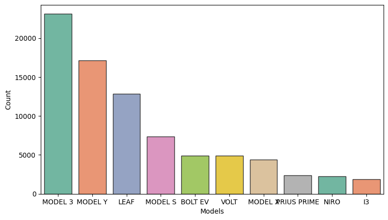
    


#What are the most sold models per each company??
#lets consider the top 10 companies


```python
top_10_companies = list(Companies)[:10]
for i in top_10_companies:
    ev_data = data[data['Make']==i]
    ev_data = data.groupby('Model').count().sort_values(by='City',ascending=False).index
    print('Top selling model for',i,'is ----------->',ev_data[0])
```

    Top selling model for TESLA is -----------> MODEL 3
    Top selling model for NISSAN is -----------> MODEL 3
    Top selling model for CHEVROLET is -----------> MODEL 3
    Top selling model for FORD is -----------> MODEL 3
    Top selling model for BMW is -----------> MODEL 3
    Top selling model for KIA is -----------> MODEL 3
    Top selling model for TOYOTA is -----------> MODEL 3
    Top selling model for VOLKSWAGEN is -----------> MODEL 3
    Top selling model for AUDI is -----------> MODEL 3
    Top selling model for VOLVO is -----------> MODEL 3
    

# Estimating the percentage of BEV and PHEV


```python
Vehicle_type = list(data.groupby('Electric Vehicle Type').count()['County'].index)
values = data.groupby('Electric Vehicle Type').count()['County'].values

px.pie(names=Vehicle_type,values=values,height=400)
```


<html>
<head><meta charset="utf-8" /></head>
<body>
    <div>            <script src="https://cdnjs.cloudflare.com/ajax/libs/mathjax/2.7.5/MathJax.js?config=TeX-AMS-MML_SVG"></script><script type="text/javascript">if (window.MathJax && window.MathJax.Hub && window.MathJax.Hub.Config) {window.MathJax.Hub.Config({SVG: {font: "STIX-Web"}});}</script>                <script type="text/javascript">window.PlotlyConfig = {MathJaxConfig: 'local'};</script>
        <script src="https://cdn.plot.ly/plotly-2.18.2.min.js"></script>                <div id="8d93c0c4-758a-43ec-8ffb-f46bb0cfcb62" class="plotly-graph-div" style="height:400px; width:100%;"></div>            <script type="text/javascript">                                    window.PLOTLYENV=window.PLOTLYENV || {};                                    if (document.getElementById("8d93c0c4-758a-43ec-8ffb-f46bb0cfcb62")) {                    Plotly.newPlot(                        "8d93c0c4-758a-43ec-8ffb-f46bb0cfcb62",                        [{"domain":{"x":[0.0,1.0],"y":[0.0,1.0]},"hovertemplate":"label=%{label}<br>value=%{value}<extra></extra>","labels":["Battery Electric Vehicle (BEV)","Plug-in Hybrid Electric Vehicle (PHEV)"],"legendgroup":"","name":"","showlegend":true,"values":[86010,26580],"type":"pie"}],                        {"template":{"data":{"histogram2dcontour":[{"type":"histogram2dcontour","colorbar":{"outlinewidth":0,"ticks":""},"colorscale":[[0.0,"#0d0887"],[0.1111111111111111,"#46039f"],[0.2222222222222222,"#7201a8"],[0.3333333333333333,"#9c179e"],[0.4444444444444444,"#bd3786"],[0.5555555555555556,"#d8576b"],[0.6666666666666666,"#ed7953"],[0.7777777777777778,"#fb9f3a"],[0.8888888888888888,"#fdca26"],[1.0,"#f0f921"]]}],"choropleth":[{"type":"choropleth","colorbar":{"outlinewidth":0,"ticks":""}}],"histogram2d":[{"type":"histogram2d","colorbar":{"outlinewidth":0,"ticks":""},"colorscale":[[0.0,"#0d0887"],[0.1111111111111111,"#46039f"],[0.2222222222222222,"#7201a8"],[0.3333333333333333,"#9c179e"],[0.4444444444444444,"#bd3786"],[0.5555555555555556,"#d8576b"],[0.6666666666666666,"#ed7953"],[0.7777777777777778,"#fb9f3a"],[0.8888888888888888,"#fdca26"],[1.0,"#f0f921"]]}],"heatmap":[{"type":"heatmap","colorbar":{"outlinewidth":0,"ticks":""},"colorscale":[[0.0,"#0d0887"],[0.1111111111111111,"#46039f"],[0.2222222222222222,"#7201a8"],[0.3333333333333333,"#9c179e"],[0.4444444444444444,"#bd3786"],[0.5555555555555556,"#d8576b"],[0.6666666666666666,"#ed7953"],[0.7777777777777778,"#fb9f3a"],[0.8888888888888888,"#fdca26"],[1.0,"#f0f921"]]}],"heatmapgl":[{"type":"heatmapgl","colorbar":{"outlinewidth":0,"ticks":""},"colorscale":[[0.0,"#0d0887"],[0.1111111111111111,"#46039f"],[0.2222222222222222,"#7201a8"],[0.3333333333333333,"#9c179e"],[0.4444444444444444,"#bd3786"],[0.5555555555555556,"#d8576b"],[0.6666666666666666,"#ed7953"],[0.7777777777777778,"#fb9f3a"],[0.8888888888888888,"#fdca26"],[1.0,"#f0f921"]]}],"contourcarpet":[{"type":"contourcarpet","colorbar":{"outlinewidth":0,"ticks":""}}],"contour":[{"type":"contour","colorbar":{"outlinewidth":0,"ticks":""},"colorscale":[[0.0,"#0d0887"],[0.1111111111111111,"#46039f"],[0.2222222222222222,"#7201a8"],[0.3333333333333333,"#9c179e"],[0.4444444444444444,"#bd3786"],[0.5555555555555556,"#d8576b"],[0.6666666666666666,"#ed7953"],[0.7777777777777778,"#fb9f3a"],[0.8888888888888888,"#fdca26"],[1.0,"#f0f921"]]}],"surface":[{"type":"surface","colorbar":{"outlinewidth":0,"ticks":""},"colorscale":[[0.0,"#0d0887"],[0.1111111111111111,"#46039f"],[0.2222222222222222,"#7201a8"],[0.3333333333333333,"#9c179e"],[0.4444444444444444,"#bd3786"],[0.5555555555555556,"#d8576b"],[0.6666666666666666,"#ed7953"],[0.7777777777777778,"#fb9f3a"],[0.8888888888888888,"#fdca26"],[1.0,"#f0f921"]]}],"mesh3d":[{"type":"mesh3d","colorbar":{"outlinewidth":0,"ticks":""}}],"scatter":[{"fillpattern":{"fillmode":"overlay","size":10,"solidity":0.2},"type":"scatter"}],"parcoords":[{"type":"parcoords","line":{"colorbar":{"outlinewidth":0,"ticks":""}}}],"scatterpolargl":[{"type":"scatterpolargl","marker":{"colorbar":{"outlinewidth":0,"ticks":""}}}],"bar":[{"error_x":{"color":"#2a3f5f"},"error_y":{"color":"#2a3f5f"},"marker":{"line":{"color":"#E5ECF6","width":0.5},"pattern":{"fillmode":"overlay","size":10,"solidity":0.2}},"type":"bar"}],"scattergeo":[{"type":"scattergeo","marker":{"colorbar":{"outlinewidth":0,"ticks":""}}}],"scatterpolar":[{"type":"scatterpolar","marker":{"colorbar":{"outlinewidth":0,"ticks":""}}}],"histogram":[{"marker":{"pattern":{"fillmode":"overlay","size":10,"solidity":0.2}},"type":"histogram"}],"scattergl":[{"type":"scattergl","marker":{"colorbar":{"outlinewidth":0,"ticks":""}}}],"scatter3d":[{"type":"scatter3d","line":{"colorbar":{"outlinewidth":0,"ticks":""}},"marker":{"colorbar":{"outlinewidth":0,"ticks":""}}}],"scattermapbox":[{"type":"scattermapbox","marker":{"colorbar":{"outlinewidth":0,"ticks":""}}}],"scatterternary":[{"type":"scatterternary","marker":{"colorbar":{"outlinewidth":0,"ticks":""}}}],"scattercarpet":[{"type":"scattercarpet","marker":{"colorbar":{"outlinewidth":0,"ticks":""}}}],"carpet":[{"aaxis":{"endlinecolor":"#2a3f5f","gridcolor":"white","linecolor":"white","minorgridcolor":"white","startlinecolor":"#2a3f5f"},"baxis":{"endlinecolor":"#2a3f5f","gridcolor":"white","linecolor":"white","minorgridcolor":"white","startlinecolor":"#2a3f5f"},"type":"carpet"}],"table":[{"cells":{"fill":{"color":"#EBF0F8"},"line":{"color":"white"}},"header":{"fill":{"color":"#C8D4E3"},"line":{"color":"white"}},"type":"table"}],"barpolar":[{"marker":{"line":{"color":"#E5ECF6","width":0.5},"pattern":{"fillmode":"overlay","size":10,"solidity":0.2}},"type":"barpolar"}],"pie":[{"automargin":true,"type":"pie"}]},"layout":{"autotypenumbers":"strict","colorway":["#636efa","#EF553B","#00cc96","#ab63fa","#FFA15A","#19d3f3","#FF6692","#B6E880","#FF97FF","#FECB52"],"font":{"color":"#2a3f5f"},"hovermode":"closest","hoverlabel":{"align":"left"},"paper_bgcolor":"white","plot_bgcolor":"#E5ECF6","polar":{"bgcolor":"#E5ECF6","angularaxis":{"gridcolor":"white","linecolor":"white","ticks":""},"radialaxis":{"gridcolor":"white","linecolor":"white","ticks":""}},"ternary":{"bgcolor":"#E5ECF6","aaxis":{"gridcolor":"white","linecolor":"white","ticks":""},"baxis":{"gridcolor":"white","linecolor":"white","ticks":""},"caxis":{"gridcolor":"white","linecolor":"white","ticks":""}},"coloraxis":{"colorbar":{"outlinewidth":0,"ticks":""}},"colorscale":{"sequential":[[0.0,"#0d0887"],[0.1111111111111111,"#46039f"],[0.2222222222222222,"#7201a8"],[0.3333333333333333,"#9c179e"],[0.4444444444444444,"#bd3786"],[0.5555555555555556,"#d8576b"],[0.6666666666666666,"#ed7953"],[0.7777777777777778,"#fb9f3a"],[0.8888888888888888,"#fdca26"],[1.0,"#f0f921"]],"sequentialminus":[[0.0,"#0d0887"],[0.1111111111111111,"#46039f"],[0.2222222222222222,"#7201a8"],[0.3333333333333333,"#9c179e"],[0.4444444444444444,"#bd3786"],[0.5555555555555556,"#d8576b"],[0.6666666666666666,"#ed7953"],[0.7777777777777778,"#fb9f3a"],[0.8888888888888888,"#fdca26"],[1.0,"#f0f921"]],"diverging":[[0,"#8e0152"],[0.1,"#c51b7d"],[0.2,"#de77ae"],[0.3,"#f1b6da"],[0.4,"#fde0ef"],[0.5,"#f7f7f7"],[0.6,"#e6f5d0"],[0.7,"#b8e186"],[0.8,"#7fbc41"],[0.9,"#4d9221"],[1,"#276419"]]},"xaxis":{"gridcolor":"white","linecolor":"white","ticks":"","title":{"standoff":15},"zerolinecolor":"white","automargin":true,"zerolinewidth":2},"yaxis":{"gridcolor":"white","linecolor":"white","ticks":"","title":{"standoff":15},"zerolinecolor":"white","automargin":true,"zerolinewidth":2},"scene":{"xaxis":{"backgroundcolor":"#E5ECF6","gridcolor":"white","linecolor":"white","showbackground":true,"ticks":"","zerolinecolor":"white","gridwidth":2},"yaxis":{"backgroundcolor":"#E5ECF6","gridcolor":"white","linecolor":"white","showbackground":true,"ticks":"","zerolinecolor":"white","gridwidth":2},"zaxis":{"backgroundcolor":"#E5ECF6","gridcolor":"white","linecolor":"white","showbackground":true,"ticks":"","zerolinecolor":"white","gridwidth":2}},"shapedefaults":{"line":{"color":"#2a3f5f"}},"annotationdefaults":{"arrowcolor":"#2a3f5f","arrowhead":0,"arrowwidth":1},"geo":{"bgcolor":"white","landcolor":"#E5ECF6","subunitcolor":"white","showland":true,"showlakes":true,"lakecolor":"white"},"title":{"x":0.05},"mapbox":{"style":"light"}}},"legend":{"tracegroupgap":0},"margin":{"t":60},"height":400},                        {"responsive": true}                    ).then(function(){

var gd = document.getElementById('8d93c0c4-758a-43ec-8ffb-f46bb0cfcb62');
var x = new MutationObserver(function (mutations, observer) {{
        var display = window.getComputedStyle(gd).display;
        if (!display || display === 'none') {{
            console.log([gd, 'removed!']);
            Plotly.purge(gd);
            observer.disconnect();
        }}
}});

// Listen for the removal of the full notebook cells
var notebookContainer = gd.closest('#notebook-container');
if (notebookContainer) {{
    x.observe(notebookContainer, {childList: true});
}}

// Listen for the clearing of the current output cell
var outputEl = gd.closest('.output');
if (outputEl) {{
    x.observe(outputEl, {childList: true});
}}

                        })                };                            </script>        </div>
</body>
</html>


#lets see the electric range difference between PHEV and BEV


```python
plt.figure(figsize=(12,5))
sns.set_style(style='dark')
sns.histplot(x = 'Electric Range',data=data,kde=True,hue='Electric Vehicle Type',palette='Set2')

```


    <Axes: xlabel='Electric Range', ylabel='Count'>


    
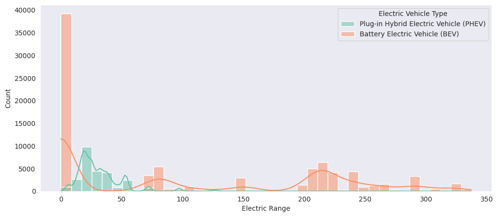
    


```python
data[data['Electric Range']==0].shape
```


    (39213, 10)


```python
#lets filter out top 5 companies as per each electric vehicle type

#PHEV

data_phev = data[data['Electric Vehicle Type']=='Plug-in Hybrid Electric Vehicle (PHEV)']
companies=list(data_phev.groupby('Make').count().sort_values(by='City',ascending=False)['City'].index)[:5]
data_phev['phe'] = data_phev['Make'].apply(lambda x:1 if x in companies else 0 )
data_phev = data_phev[data_phev['phe']==1]

plt.figure(figsize=(10,5))
sns.kdeplot(x='Electric Range',hue='Make',data=data_phev)
```

    <ipython-input-18-c8b3dfb7ebd6>:7: SettingWithCopyWarning:
    
    
    A value is trying to be set on a copy of a slice from a DataFrame.
    Try using .loc[row_indexer,col_indexer] = value instead
    
    See the caveats in the documentation: https://pandas.pydata.org/pandas-docs/stable/user_guide/indexing.html#returning-a-view-versus-a-copy
    
    


    <Axes: xlabel='Electric Range', ylabel='Density'>


    
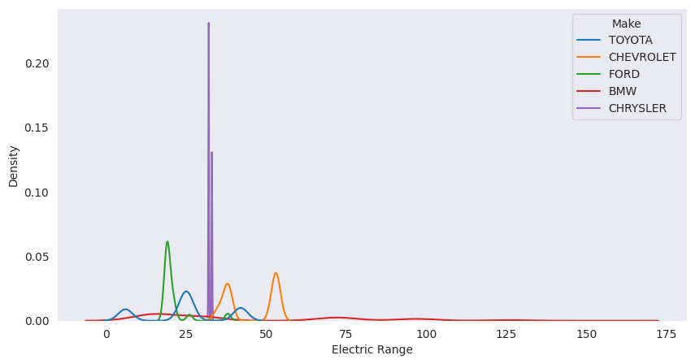
    


```python
#BEV


data_bev = data[data['Electric Vehicle Type']!='Plug-in Hybrid Electric Vehicle (PHEV)']
companies=list(data_bev.groupby('Make').count().sort_values(by='City',ascending=False)['City'].index)[:5]
data_bev['bev'] = data_bev['Make'].apply(lambda x:1 if x in companies else 0 )
data_bev = data_bev[data_bev['bev']==1]

plt.figure(figsize=(10,5))
sns.kdeplot(x='Electric Range',hue='Make',data=data_bev)
```

    <ipython-input-19-e3ed2007bae1>:6: SettingWithCopyWarning:
    
    
    A value is trying to be set on a copy of a slice from a DataFrame.
    Try using .loc[row_indexer,col_indexer] = value instead
    
    See the caveats in the documentation: https://pandas.pydata.org/pandas-docs/stable/user_guide/indexing.html#returning-a-view-versus-a-copy
    
    


    <Axes: xlabel='Electric Range', ylabel='Density'>


    
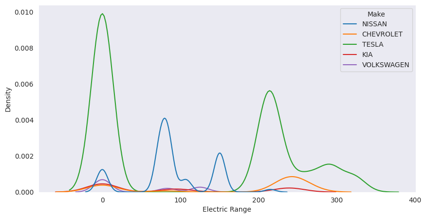
    


```python
top_10_vehicles = list(data.groupby('Model').count().sort_values(by='City',ascending=False)['City'].index)[:10]
```


```python
top_10_range =  data.sort_values(by='Electric Range',ascending=False)['Model'].unique()[:10]
```


```python
top_10_vehicles
```


    ['MODEL 3',
     'MODEL Y',
     'LEAF',
     'MODEL S',
     'BOLT EV',
     'VOLT',
     'MODEL X',
     'PRIUS PRIME',
     'NIRO',
     'I3']


```python
top_10_range
```


    array(['MODEL S', 'MODEL 3', 'MODEL X', 'MODEL Y', 'BOLT EV', 'KONA',
           'ROADSTER', 'NIRO', 'I-PACE', 'PS2'], dtype=object)


```python
#Number of models of company for each year for last 10 years
#lets consider top_10 companies only

dat = data.copy()
dat['top_10'] = dat['Make'].apply(lambda x:1 if x in top_10_companies else 0)
dat = dat[dat['top_10']==1]
dat = dat[data['Model Year']>=2011]
plt.figure(figsize=(12,5))
sns.countplot(x = 'Model Year',hue='Make',data=dat)
```

    <ipython-input-24-928231dbcc38>:7: UserWarning:
    
    Boolean Series key will be reindexed to match DataFrame index.
    
    


    <Axes: xlabel='Model Year', ylabel='count'>


    
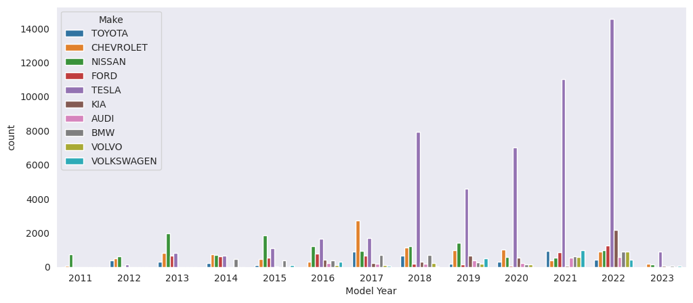
    


```python
#if we study an individual company TESLA
#1.which state is having more number of TESLA vehicles
#2.Model of which year is in use the most from TESLA

data_TESLA = data[data['Make']=='TESLA']
top_10_states_TESLA = list(data_TESLA.groupby('State').count().sort_values(by='City',ascending=False)['City'].index)[:10]
values = list(data_TESLA.groupby('State').count().sort_values(by='City',ascending=False)['City'].values)[:10]
```


```python
sns.barplot(x = top_10_states_TESLA,y=values,edgecolor='.2')
```


    <Axes: >


    
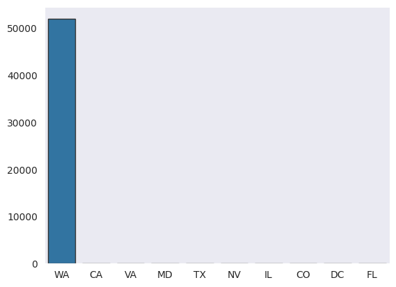
    


```python
values
```


    [51943, 39, 17, 10, 9, 5, 4, 4, 3, 3]


```python
plt.figure(figsize=(10,6))
top_10_year_TESLA = list(data_TESLA.groupby('Model Year').count().sort_values(by='City',ascending=False)['City'].index)[:10]
values = list(data_TESLA.groupby('Model Year').count().sort_values(by='City',ascending=False)['City'].values)[:10]
sns.barplot(x = top_10_year_TESLA,y=values,edgecolor='.2')
```


    <Axes: >


    
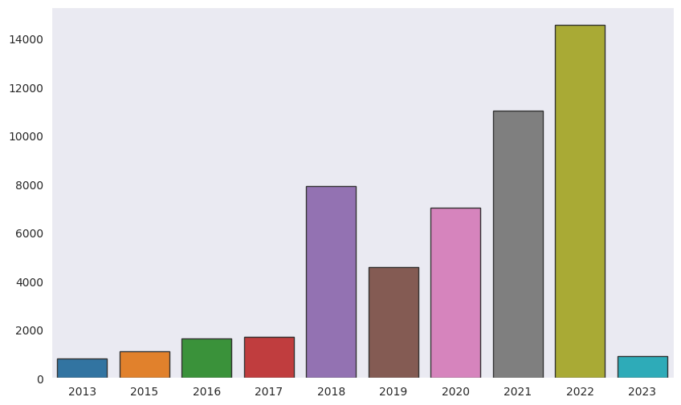
    


```python
locations = list(data.groupby('Vehicle Location').count()['County'].index)
values = list(data.groupby('Vehicle Location').count()['County'].values)
Location_data = pd.DataFrame({'Locations':locations,'Count':values})
Location_data['Lattitude'] = Location_data['Locations'].apply(lambda x:float(x.split(' ')[1][1:]))
Location_data['Longitude'] = Location_data['Locations'].apply(lambda x:float(x.split(' ')[2][:-1]))

plt.figure(figsize=(10,5))
plt.scatter(x = Location_data['Lattitude'],y = Location_data['Longitude'],s=Location_data['Count'])
plt.xlim(-130,-60)
plt.ylim(20,60)
```


    (20.0, 60.0)


    
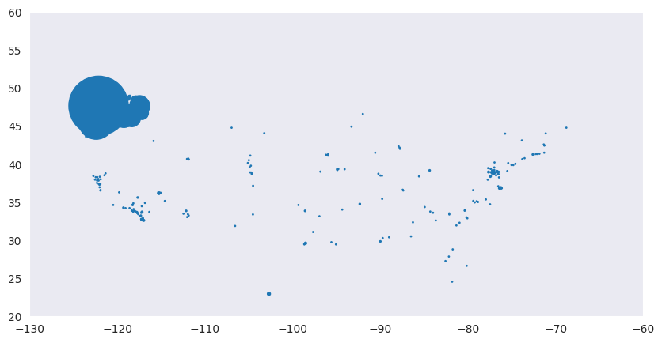
    


```python
data['Lattitude'] = data['Vehicle Location'].apply(lambda x:float(x.split(' ')[1][1:]))
data['Longitude'] = data['Vehicle Location'].apply(lambda x:float(x.split(' ')[2][:-1]))
```


```python
plt.figure(figsize=(10,5))
sns.scatterplot(x = 'Lattitude',y = 'Longitude',data=data,hue='Clean Alternative Fuel Vehicle (CAFV) Eligibility',palette='Set2')
plt.xlim(-130,-60)
plt.ylim(20,50)
```


    (20.0, 50.0)


    /usr/local/lib/python3.10/dist-packages/IPython/core/events.py:89: UserWarning:
    
    Creating legend with loc="best" can be slow with large amounts of data.
    
    /usr/local/lib/python3.10/dist-packages/IPython/core/pylabtools.py:151: UserWarning:
    
    Creating legend with loc="best" can be slow with large amounts of data.
    
    


    
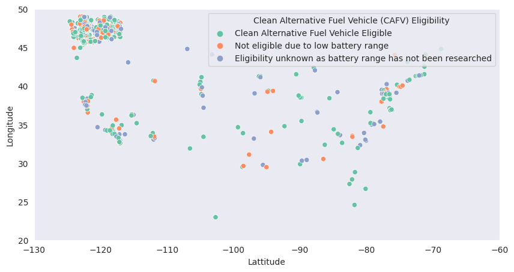
    


```python
plt.figure(figsize=(10,5))
sns.scatterplot(x = 'Lattitude',y = 'Longitude',data=data,hue='Electric Vehicle Type',palette='Set1')
plt.xlim(-130,-60)
plt.ylim(20,50)
```


    (20.0, 50.0)


    
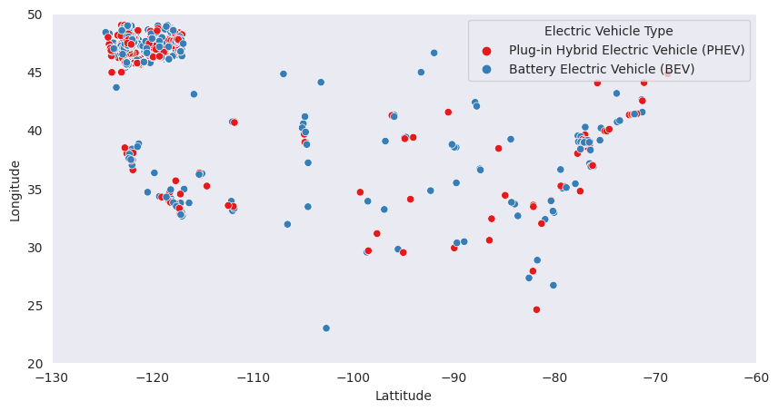
    


```python
states = list(data.groupby('State').count().sort_values(by='City',ascending=False)['City'].index)
values = data.groupby('State').count().sort_values(by='City',ascending=False)['City'].values
```


```python
dat = pd.DataFrame(data.groupby('State').count().sort_values(by='City',ascending=False)['City'])
```


```python
dat = dat.reset_index()
```


```python
dat.columns = ['State','Count']
```


```python
fig = px.choropleth(dat,
                    locations='State',
                    locationmode="USA-states",
                    color='Count',
                    color_continuous_scale="greens",
                    scope="usa")

fig.show()
```


<html>
<head><meta charset="utf-8" /></head>
<body>
    <div>            <script src="https://cdnjs.cloudflare.com/ajax/libs/mathjax/2.7.5/MathJax.js?config=TeX-AMS-MML_SVG"></script><script type="text/javascript">if (window.MathJax && window.MathJax.Hub && window.MathJax.Hub.Config) {window.MathJax.Hub.Config({SVG: {font: "STIX-Web"}});}</script>                <script type="text/javascript">window.PlotlyConfig = {MathJaxConfig: 'local'};</script>
        <script src="https://cdn.plot.ly/plotly-2.18.2.min.js"></script>                <div id="ef7e5b92-8955-4e76-a7cd-8f8d73ec7e37" class="plotly-graph-div" style="height:525px; width:100%;"></div>            <script type="text/javascript">                                    window.PLOTLYENV=window.PLOTLYENV || {};                                    if (document.getElementById("ef7e5b92-8955-4e76-a7cd-8f8d73ec7e37")) {                    Plotly.newPlot(                        "ef7e5b92-8955-4e76-a7cd-8f8d73ec7e37",                        [{"coloraxis":"coloraxis","geo":"geo","hovertemplate":"State=%{location}<br>Count=%{z}<extra></extra>","locationmode":"USA-states","locations":["WA","CA","VA","MD","TX","CO","NV","GA","NC","AZ","CT","DC","FL","IL","NE","OR","SC","NY","AR","UT","HI","NJ","TN","MA","MO","LA","KS","PA","ID","OH","WY","SD","WI","RI","AK","OK","NM","NH","ND","AL","MN","ME","KY","DE","MS"],"name":"","z":[112309,74,36,26,13,9,8,7,7,6,6,6,6,6,5,5,5,4,4,4,4,3,3,3,3,3,3,2,2,2,2,1,1,1,1,1,1,1,1,1,1,1,1,1,1],"type":"choropleth"}],                        {"template":{"data":{"histogram2dcontour":[{"type":"histogram2dcontour","colorbar":{"outlinewidth":0,"ticks":""},"colorscale":[[0.0,"#0d0887"],[0.1111111111111111,"#46039f"],[0.2222222222222222,"#7201a8"],[0.3333333333333333,"#9c179e"],[0.4444444444444444,"#bd3786"],[0.5555555555555556,"#d8576b"],[0.6666666666666666,"#ed7953"],[0.7777777777777778,"#fb9f3a"],[0.8888888888888888,"#fdca26"],[1.0,"#f0f921"]]}],"choropleth":[{"type":"choropleth","colorbar":{"outlinewidth":0,"ticks":""}}],"histogram2d":[{"type":"histogram2d","colorbar":{"outlinewidth":0,"ticks":""},"colorscale":[[0.0,"#0d0887"],[0.1111111111111111,"#46039f"],[0.2222222222222222,"#7201a8"],[0.3333333333333333,"#9c179e"],[0.4444444444444444,"#bd3786"],[0.5555555555555556,"#d8576b"],[0.6666666666666666,"#ed7953"],[0.7777777777777778,"#fb9f3a"],[0.8888888888888888,"#fdca26"],[1.0,"#f0f921"]]}],"heatmap":[{"type":"heatmap","colorbar":{"outlinewidth":0,"ticks":""},"colorscale":[[0.0,"#0d0887"],[0.1111111111111111,"#46039f"],[0.2222222222222222,"#7201a8"],[0.3333333333333333,"#9c179e"],[0.4444444444444444,"#bd3786"],[0.5555555555555556,"#d8576b"],[0.6666666666666666,"#ed7953"],[0.7777777777777778,"#fb9f3a"],[0.8888888888888888,"#fdca26"],[1.0,"#f0f921"]]}],"heatmapgl":[{"type":"heatmapgl","colorbar":{"outlinewidth":0,"ticks":""},"colorscale":[[0.0,"#0d0887"],[0.1111111111111111,"#46039f"],[0.2222222222222222,"#7201a8"],[0.3333333333333333,"#9c179e"],[0.4444444444444444,"#bd3786"],[0.5555555555555556,"#d8576b"],[0.6666666666666666,"#ed7953"],[0.7777777777777778,"#fb9f3a"],[0.8888888888888888,"#fdca26"],[1.0,"#f0f921"]]}],"contourcarpet":[{"type":"contourcarpet","colorbar":{"outlinewidth":0,"ticks":""}}],"contour":[{"type":"contour","colorbar":{"outlinewidth":0,"ticks":""},"colorscale":[[0.0,"#0d0887"],[0.1111111111111111,"#46039f"],[0.2222222222222222,"#7201a8"],[0.3333333333333333,"#9c179e"],[0.4444444444444444,"#bd3786"],[0.5555555555555556,"#d8576b"],[0.6666666666666666,"#ed7953"],[0.7777777777777778,"#fb9f3a"],[0.8888888888888888,"#fdca26"],[1.0,"#f0f921"]]}],"surface":[{"type":"surface","colorbar":{"outlinewidth":0,"ticks":""},"colorscale":[[0.0,"#0d0887"],[0.1111111111111111,"#46039f"],[0.2222222222222222,"#7201a8"],[0.3333333333333333,"#9c179e"],[0.4444444444444444,"#bd3786"],[0.5555555555555556,"#d8576b"],[0.6666666666666666,"#ed7953"],[0.7777777777777778,"#fb9f3a"],[0.8888888888888888,"#fdca26"],[1.0,"#f0f921"]]}],"mesh3d":[{"type":"mesh3d","colorbar":{"outlinewidth":0,"ticks":""}}],"scatter":[{"fillpattern":{"fillmode":"overlay","size":10,"solidity":0.2},"type":"scatter"}],"parcoords":[{"type":"parcoords","line":{"colorbar":{"outlinewidth":0,"ticks":""}}}],"scatterpolargl":[{"type":"scatterpolargl","marker":{"colorbar":{"outlinewidth":0,"ticks":""}}}],"bar":[{"error_x":{"color":"#2a3f5f"},"error_y":{"color":"#2a3f5f"},"marker":{"line":{"color":"#E5ECF6","width":0.5},"pattern":{"fillmode":"overlay","size":10,"solidity":0.2}},"type":"bar"}],"scattergeo":[{"type":"scattergeo","marker":{"colorbar":{"outlinewidth":0,"ticks":""}}}],"scatterpolar":[{"type":"scatterpolar","marker":{"colorbar":{"outlinewidth":0,"ticks":""}}}],"histogram":[{"marker":{"pattern":{"fillmode":"overlay","size":10,"solidity":0.2}},"type":"histogram"}],"scattergl":[{"type":"scattergl","marker":{"colorbar":{"outlinewidth":0,"ticks":""}}}],"scatter3d":[{"type":"scatter3d","line":{"colorbar":{"outlinewidth":0,"ticks":""}},"marker":{"colorbar":{"outlinewidth":0,"ticks":""}}}],"scattermapbox":[{"type":"scattermapbox","marker":{"colorbar":{"outlinewidth":0,"ticks":""}}}],"scatterternary":[{"type":"scatterternary","marker":{"colorbar":{"outlinewidth":0,"ticks":""}}}],"scattercarpet":[{"type":"scattercarpet","marker":{"colorbar":{"outlinewidth":0,"ticks":""}}}],"carpet":[{"aaxis":{"endlinecolor":"#2a3f5f","gridcolor":"white","linecolor":"white","minorgridcolor":"white","startlinecolor":"#2a3f5f"},"baxis":{"endlinecolor":"#2a3f5f","gridcolor":"white","linecolor":"white","minorgridcolor":"white","startlinecolor":"#2a3f5f"},"type":"carpet"}],"table":[{"cells":{"fill":{"color":"#EBF0F8"},"line":{"color":"white"}},"header":{"fill":{"color":"#C8D4E3"},"line":{"color":"white"}},"type":"table"}],"barpolar":[{"marker":{"line":{"color":"#E5ECF6","width":0.5},"pattern":{"fillmode":"overlay","size":10,"solidity":0.2}},"type":"barpolar"}],"pie":[{"automargin":true,"type":"pie"}]},"layout":{"autotypenumbers":"strict","colorway":["#636efa","#EF553B","#00cc96","#ab63fa","#FFA15A","#19d3f3","#FF6692","#B6E880","#FF97FF","#FECB52"],"font":{"color":"#2a3f5f"},"hovermode":"closest","hoverlabel":{"align":"left"},"paper_bgcolor":"white","plot_bgcolor":"#E5ECF6","polar":{"bgcolor":"#E5ECF6","angularaxis":{"gridcolor":"white","linecolor":"white","ticks":""},"radialaxis":{"gridcolor":"white","linecolor":"white","ticks":""}},"ternary":{"bgcolor":"#E5ECF6","aaxis":{"gridcolor":"white","linecolor":"white","ticks":""},"baxis":{"gridcolor":"white","linecolor":"white","ticks":""},"caxis":{"gridcolor":"white","linecolor":"white","ticks":""}},"coloraxis":{"colorbar":{"outlinewidth":0,"ticks":""}},"colorscale":{"sequential":[[0.0,"#0d0887"],[0.1111111111111111,"#46039f"],[0.2222222222222222,"#7201a8"],[0.3333333333333333,"#9c179e"],[0.4444444444444444,"#bd3786"],[0.5555555555555556,"#d8576b"],[0.6666666666666666,"#ed7953"],[0.7777777777777778,"#fb9f3a"],[0.8888888888888888,"#fdca26"],[1.0,"#f0f921"]],"sequentialminus":[[0.0,"#0d0887"],[0.1111111111111111,"#46039f"],[0.2222222222222222,"#7201a8"],[0.3333333333333333,"#9c179e"],[0.4444444444444444,"#bd3786"],[0.5555555555555556,"#d8576b"],[0.6666666666666666,"#ed7953"],[0.7777777777777778,"#fb9f3a"],[0.8888888888888888,"#fdca26"],[1.0,"#f0f921"]],"diverging":[[0,"#8e0152"],[0.1,"#c51b7d"],[0.2,"#de77ae"],[0.3,"#f1b6da"],[0.4,"#fde0ef"],[0.5,"#f7f7f7"],[0.6,"#e6f5d0"],[0.7,"#b8e186"],[0.8,"#7fbc41"],[0.9,"#4d9221"],[1,"#276419"]]},"xaxis":{"gridcolor":"white","linecolor":"white","ticks":"","title":{"standoff":15},"zerolinecolor":"white","automargin":true,"zerolinewidth":2},"yaxis":{"gridcolor":"white","linecolor":"white","ticks":"","title":{"standoff":15},"zerolinecolor":"white","automargin":true,"zerolinewidth":2},"scene":{"xaxis":{"backgroundcolor":"#E5ECF6","gridcolor":"white","linecolor":"white","showbackground":true,"ticks":"","zerolinecolor":"white","gridwidth":2},"yaxis":{"backgroundcolor":"#E5ECF6","gridcolor":"white","linecolor":"white","showbackground":true,"ticks":"","zerolinecolor":"white","gridwidth":2},"zaxis":{"backgroundcolor":"#E5ECF6","gridcolor":"white","linecolor":"white","showbackground":true,"ticks":"","zerolinecolor":"white","gridwidth":2}},"shapedefaults":{"line":{"color":"#2a3f5f"}},"annotationdefaults":{"arrowcolor":"#2a3f5f","arrowhead":0,"arrowwidth":1},"geo":{"bgcolor":"white","landcolor":"#E5ECF6","subunitcolor":"white","showland":true,"showlakes":true,"lakecolor":"white"},"title":{"x":0.05},"mapbox":{"style":"light"}}},"geo":{"domain":{"x":[0.0,1.0],"y":[0.0,1.0]},"center":{},"scope":"usa"},"coloraxis":{"colorbar":{"title":{"text":"Count"}},"colorscale":[[0.0,"rgb(247,252,245)"],[0.125,"rgb(229,245,224)"],[0.25,"rgb(199,233,192)"],[0.375,"rgb(161,217,155)"],[0.5,"rgb(116,196,118)"],[0.625,"rgb(65,171,93)"],[0.75,"rgb(35,139,69)"],[0.875,"rgb(0,109,44)"],[1.0,"rgb(0,68,27)"]]},"legend":{"tracegroupgap":0},"margin":{"t":60}},                        {"responsive": true}                    ).then(function(){

var gd = document.getElementById('ef7e5b92-8955-4e76-a7cd-8f8d73ec7e37');
var x = new MutationObserver(function (mutations, observer) {{
        var display = window.getComputedStyle(gd).display;
        if (!display || display === 'none') {{
            console.log([gd, 'removed!']);
            Plotly.purge(gd);
            observer.disconnect();
        }}
}});

// Listen for the removal of the full notebook cells
var notebookContainer = gd.closest('#notebook-container');
if (notebookContainer) {{
    x.observe(notebookContainer, {childList: true});
}}

// Listen for the clearing of the current output cell
var outputEl = gd.closest('.output');
if (outputEl) {{
    x.observe(outputEl, {childList: true});
}}

                        })                };                            </script>        </div>
</body>
</html>


```python
dat
```


  <div id="df-d4898bfc-03ca-44f3-b11e-96ea1d8214d3">
    <div class="colab-df-container">
      <div>
<style scoped>
    .dataframe tbody tr th:only-of-type {
        vertical-align: middle;
    }

    .dataframe tbody tr th {
        vertical-align: top;
    }

    .dataframe thead th {
        text-align: right;
    }
</style>
<table border="1" class="dataframe">
  <thead>
    <tr style="text-align: right;">
      <th></th>
      <th>State</th>
      <th>Count</th>
    </tr>
  </thead>
  <tbody>
    <tr>
      <th>0</th>
      <td>WA</td>
      <td>112309</td>
    </tr>
    <tr>
      <th>1</th>
      <td>CA</td>
      <td>74</td>
    </tr>
    <tr>
      <th>2</th>
      <td>VA</td>
      <td>36</td>
    </tr>
    <tr>
      <th>3</th>
      <td>MD</td>
      <td>26</td>
    </tr>
    <tr>
      <th>4</th>
      <td>TX</td>
      <td>13</td>
    </tr>
    <tr>
      <th>5</th>
      <td>CO</td>
      <td>9</td>
    </tr>
    <tr>
      <th>6</th>
      <td>NV</td>
      <td>8</td>
    </tr>
    <tr>
      <th>7</th>
      <td>GA</td>
      <td>7</td>
    </tr>
    <tr>
      <th>8</th>
      <td>NC</td>
      <td>7</td>
    </tr>
    <tr>
      <th>9</th>
      <td>AZ</td>
      <td>6</td>
    </tr>
    <tr>
      <th>10</th>
      <td>CT</td>
      <td>6</td>
    </tr>
    <tr>
      <th>11</th>
      <td>DC</td>
      <td>6</td>
    </tr>
    <tr>
      <th>12</th>
      <td>FL</td>
      <td>6</td>
    </tr>
    <tr>
      <th>13</th>
      <td>IL</td>
      <td>6</td>
    </tr>
    <tr>
      <th>14</th>
      <td>NE</td>
      <td>5</td>
    </tr>
    <tr>
      <th>15</th>
      <td>OR</td>
      <td>5</td>
    </tr>
    <tr>
      <th>16</th>
      <td>SC</td>
      <td>5</td>
    </tr>
    <tr>
      <th>17</th>
      <td>NY</td>
      <td>4</td>
    </tr>
    <tr>
      <th>18</th>
      <td>AR</td>
      <td>4</td>
    </tr>
    <tr>
      <th>19</th>
      <td>UT</td>
      <td>4</td>
    </tr>
    <tr>
      <th>20</th>
      <td>HI</td>
      <td>4</td>
    </tr>
    <tr>
      <th>21</th>
      <td>NJ</td>
      <td>3</td>
    </tr>
    <tr>
      <th>22</th>
      <td>TN</td>
      <td>3</td>
    </tr>
    <tr>
      <th>23</th>
      <td>MA</td>
      <td>3</td>
    </tr>
    <tr>
      <th>24</th>
      <td>MO</td>
      <td>3</td>
    </tr>
    <tr>
      <th>25</th>
      <td>LA</td>
      <td>3</td>
    </tr>
    <tr>
      <th>26</th>
      <td>KS</td>
      <td>3</td>
    </tr>
    <tr>
      <th>27</th>
      <td>PA</td>
      <td>2</td>
    </tr>
    <tr>
      <th>28</th>
      <td>ID</td>
      <td>2</td>
    </tr>
    <tr>
      <th>29</th>
      <td>OH</td>
      <td>2</td>
    </tr>
    <tr>
      <th>30</th>
      <td>WY</td>
      <td>2</td>
    </tr>
    <tr>
      <th>31</th>
      <td>SD</td>
      <td>1</td>
    </tr>
    <tr>
      <th>32</th>
      <td>WI</td>
      <td>1</td>
    </tr>
    <tr>
      <th>33</th>
      <td>RI</td>
      <td>1</td>
    </tr>
    <tr>
      <th>34</th>
      <td>AK</td>
      <td>1</td>
    </tr>
    <tr>
      <th>35</th>
      <td>OK</td>
      <td>1</td>
    </tr>
    <tr>
      <th>36</th>
      <td>NM</td>
      <td>1</td>
    </tr>
    <tr>
      <th>37</th>
      <td>NH</td>
      <td>1</td>
    </tr>
    <tr>
      <th>38</th>
      <td>ND</td>
      <td>1</td>
    </tr>
    <tr>
      <th>39</th>
      <td>AL</td>
      <td>1</td>
    </tr>
    <tr>
      <th>40</th>
      <td>MN</td>
      <td>1</td>
    </tr>
    <tr>
      <th>41</th>
      <td>ME</td>
      <td>1</td>
    </tr>
    <tr>
      <th>42</th>
      <td>KY</td>
      <td>1</td>
    </tr>
    <tr>
      <th>43</th>
      <td>DE</td>
      <td>1</td>
    </tr>
    <tr>
      <th>44</th>
      <td>MS</td>
      <td>1</td>
    </tr>
  </tbody>
</table>
</div>
      <button class="colab-df-convert" onclick="convertToInteractive('df-d4898bfc-03ca-44f3-b11e-96ea1d8214d3')"
              title="Convert this dataframe to an interactive table."
              style="display:none;">

  <svg xmlns="http://www.w3.org/2000/svg" height="24px"viewBox="0 0 24 24"
       width="24px">
    <path d="M0 0h24v24H0V0z" fill="none"/>
    <path d="M18.56 5.44l.94 2.06.94-2.06 2.06-.94-2.06-.94-.94-2.06-.94 2.06-2.06.94zm-11 1L8.5 8.5l.94-2.06 2.06-.94-2.06-.94L8.5 2.5l-.94 2.06-2.06.94zm10 10l.94 2.06.94-2.06 2.06-.94-2.06-.94-.94-2.06-.94 2.06-2.06.94z"/><path d="M17.41 7.96l-1.37-1.37c-.4-.4-.92-.59-1.43-.59-.52 0-1.04.2-1.43.59L10.3 9.45l-7.72 7.72c-.78.78-.78 2.05 0 2.83L4 21.41c.39.39.9.59 1.41.59.51 0 1.02-.2 1.41-.59l7.78-7.78 2.81-2.81c.8-.78.8-2.07 0-2.86zM5.41 20L4 18.59l7.72-7.72 1.47 1.35L5.41 20z"/>
  </svg>
      </button>

  <style>
    .colab-df-container {
      display:flex;
      flex-wrap:wrap;
      gap: 12px;
    }

    .colab-df-convert {
      background-color: #E8F0FE;
      border: none;
      border-radius: 50%;
      cursor: pointer;
      display: none;
      fill: #1967D2;
      height: 32px;
      padding: 0 0 0 0;
      width: 32px;
    }

    .colab-df-convert:hover {
      background-color: #E2EBFA;
      box-shadow: 0px 1px 2px rgba(60, 64, 67, 0.3), 0px 1px 3px 1px rgba(60, 64, 67, 0.15);
      fill: #174EA6;
    }

    [theme=dark] .colab-df-convert {
      background-color: #3B4455;
      fill: #D2E3FC;
    }

    [theme=dark] .colab-df-convert:hover {
      background-color: #434B5C;
      box-shadow: 0px 1px 3px 1px rgba(0, 0, 0, 0.15);
      filter: drop-shadow(0px 1px 2px rgba(0, 0, 0, 0.3));
      fill: #FFFFFF;
    }
  </style>

      <script>
        const buttonEl =
          document.querySelector('#df-d4898bfc-03ca-44f3-b11e-96ea1d8214d3 button.colab-df-convert');
        buttonEl.style.display =
          google.colab.kernel.accessAllowed ? 'block' : 'none';

        async function convertToInteractive(key) {
          const element = document.querySelector('#df-d4898bfc-03ca-44f3-b11e-96ea1d8214d3');
          const dataTable =
            await google.colab.kernel.invokeFunction('convertToInteractive',
                                                     [key], {});
          if (!dataTable) return;

          const docLinkHtml = 'Like what you see? Visit the ' +
            '<a target="_blank" href=https://colab.research.google.com/notebooks/data_table.ipynb>data table notebook</a>'
            + ' to learn more about interactive tables.';
          element.innerHTML = '';
          dataTable['output_type'] = 'display_data';
          await google.colab.output.renderOutput(dataTable, element);
          const docLink = document.createElement('div');
          docLink.innerHTML = docLinkHtml;
          element.appendChild(docLink);
        }
      </script>
    </div>
  </div>


```python
data
```


  <div id="df-b1df2cb6-2dc0-4801-a5a1-63d20810d0c3">
    <div class="colab-df-container">
      <div>
<style scoped>
    .dataframe tbody tr th:only-of-type {
        vertical-align: middle;
    }

    .dataframe tbody tr th {
        vertical-align: top;
    }

    .dataframe thead th {
        text-align: right;
    }
</style>
<table border="1" class="dataframe">
  <thead>
    <tr style="text-align: right;">
      <th></th>
      <th>County</th>
      <th>City</th>
      <th>State</th>
      <th>Model Year</th>
      <th>Make</th>
      <th>Model</th>
      <th>Electric Vehicle Type</th>
      <th>Clean Alternative Fuel Vehicle (CAFV) Eligibility</th>
      <th>Electric Range</th>
      <th>Vehicle Location</th>
      <th>Lattitude</th>
      <th>Longitude</th>
    </tr>
  </thead>
  <tbody>
    <tr>
      <th>0</th>
      <td>Monroe</td>
      <td>Key West</td>
      <td>FL</td>
      <td>2022</td>
      <td>TOYOTA</td>
      <td>RAV4 PRIME</td>
      <td>Plug-in Hybrid Electric Vehicle (PHEV)</td>
      <td>Clean Alternative Fuel Vehicle Eligible</td>
      <td>42</td>
      <td>POINT (-81.80023 24.5545)</td>
      <td>-81.80023</td>
      <td>24.55450</td>
    </tr>
    <tr>
      <th>1</th>
      <td>Clark</td>
      <td>Laughlin</td>
      <td>NV</td>
      <td>2013</td>
      <td>CHEVROLET</td>
      <td>VOLT</td>
      <td>Plug-in Hybrid Electric Vehicle (PHEV)</td>
      <td>Clean Alternative Fuel Vehicle Eligible</td>
      <td>38</td>
      <td>POINT (-114.57245 35.16815)</td>
      <td>-114.57245</td>
      <td>35.16815</td>
    </tr>
    <tr>
      <th>2</th>
      <td>Yakima</td>
      <td>Yakima</td>
      <td>WA</td>
      <td>2011</td>
      <td>NISSAN</td>
      <td>LEAF</td>
      <td>Battery Electric Vehicle (BEV)</td>
      <td>Clean Alternative Fuel Vehicle Eligible</td>
      <td>73</td>
      <td>POINT (-120.50721 46.60448)</td>
      <td>-120.50721</td>
      <td>46.60448</td>
    </tr>
    <tr>
      <th>3</th>
      <td>Skagit</td>
      <td>Concrete</td>
      <td>WA</td>
      <td>2017</td>
      <td>CHEVROLET</td>
      <td>BOLT EV</td>
      <td>Battery Electric Vehicle (BEV)</td>
      <td>Clean Alternative Fuel Vehicle Eligible</td>
      <td>238</td>
      <td>POINT (-121.7515 48.53892)</td>
      <td>-121.75150</td>
      <td>48.53892</td>
    </tr>
    <tr>
      <th>4</th>
      <td>Snohomish</td>
      <td>Everett</td>
      <td>WA</td>
      <td>2019</td>
      <td>FORD</td>
      <td>FUSION</td>
      <td>Plug-in Hybrid Electric Vehicle (PHEV)</td>
      <td>Not eligible due to low battery range</td>
      <td>26</td>
      <td>POINT (-122.20596 47.97659)</td>
      <td>-122.20596</td>
      <td>47.97659</td>
    </tr>
    <tr>
      <th>...</th>
      <td>...</td>
      <td>...</td>
      <td>...</td>
      <td>...</td>
      <td>...</td>
      <td>...</td>
      <td>...</td>
      <td>...</td>
      <td>...</td>
      <td>...</td>
      <td>...</td>
      <td>...</td>
    </tr>
    <tr>
      <th>112629</th>
      <td>King</td>
      <td>Duvall</td>
      <td>WA</td>
      <td>2022</td>
      <td>TESLA</td>
      <td>MODEL Y</td>
      <td>Battery Electric Vehicle (BEV)</td>
      <td>Eligibility unknown as battery range has not b...</td>
      <td>0</td>
      <td>POINT (-121.98609 47.74068)</td>
      <td>-121.98609</td>
      <td>47.74068</td>
    </tr>
    <tr>
      <th>112630</th>
      <td>San Juan</td>
      <td>Friday Harbor</td>
      <td>WA</td>
      <td>2019</td>
      <td>NISSAN</td>
      <td>LEAF</td>
      <td>Battery Electric Vehicle (BEV)</td>
      <td>Clean Alternative Fuel Vehicle Eligible</td>
      <td>150</td>
      <td>POINT (-123.01648 48.53448)</td>
      <td>-123.01648</td>
      <td>48.53448</td>
    </tr>
    <tr>
      <th>112631</th>
      <td>King</td>
      <td>Vashon</td>
      <td>WA</td>
      <td>2022</td>
      <td>FORD</td>
      <td>ESCAPE</td>
      <td>Plug-in Hybrid Electric Vehicle (PHEV)</td>
      <td>Clean Alternative Fuel Vehicle Eligible</td>
      <td>38</td>
      <td>POINT (-122.4573 47.44929)</td>
      <td>-122.45730</td>
      <td>47.44929</td>
    </tr>
    <tr>
      <th>112632</th>
      <td>King</td>
      <td>Covington</td>
      <td>WA</td>
      <td>2018</td>
      <td>KIA</td>
      <td>NIRO</td>
      <td>Plug-in Hybrid Electric Vehicle (PHEV)</td>
      <td>Not eligible due to low battery range</td>
      <td>26</td>
      <td>POINT (-122.09124 47.33778)</td>
      <td>-122.09124</td>
      <td>47.33778</td>
    </tr>
    <tr>
      <th>112633</th>
      <td>King</td>
      <td>Covington</td>
      <td>WA</td>
      <td>2022</td>
      <td>VOLVO</td>
      <td>XC90</td>
      <td>Plug-in Hybrid Electric Vehicle (PHEV)</td>
      <td>Not eligible due to low battery range</td>
      <td>18</td>
      <td>POINT (-122.09124 47.33778)</td>
      <td>-122.09124</td>
      <td>47.33778</td>
    </tr>
  </tbody>
</table>
<p>112590 rows × 12 columns</p>
</div>
      <button class="colab-df-convert" onclick="convertToInteractive('df-b1df2cb6-2dc0-4801-a5a1-63d20810d0c3')"
              title="Convert this dataframe to an interactive table."
              style="display:none;">

  <svg xmlns="http://www.w3.org/2000/svg" height="24px"viewBox="0 0 24 24"
       width="24px">
    <path d="M0 0h24v24H0V0z" fill="none"/>
    <path d="M18.56 5.44l.94 2.06.94-2.06 2.06-.94-2.06-.94-.94-2.06-.94 2.06-2.06.94zm-11 1L8.5 8.5l.94-2.06 2.06-.94-2.06-.94L8.5 2.5l-.94 2.06-2.06.94zm10 10l.94 2.06.94-2.06 2.06-.94-2.06-.94-.94-2.06-.94 2.06-2.06.94z"/><path d="M17.41 7.96l-1.37-1.37c-.4-.4-.92-.59-1.43-.59-.52 0-1.04.2-1.43.59L10.3 9.45l-7.72 7.72c-.78.78-.78 2.05 0 2.83L4 21.41c.39.39.9.59 1.41.59.51 0 1.02-.2 1.41-.59l7.78-7.78 2.81-2.81c.8-.78.8-2.07 0-2.86zM5.41 20L4 18.59l7.72-7.72 1.47 1.35L5.41 20z"/>
  </svg>
      </button>

  <style>
    .colab-df-container {
      display:flex;
      flex-wrap:wrap;
      gap: 12px;
    }

    .colab-df-convert {
      background-color: #E8F0FE;
      border: none;
      border-radius: 50%;
      cursor: pointer;
      display: none;
      fill: #1967D2;
      height: 32px;
      padding: 0 0 0 0;
      width: 32px;
    }

    .colab-df-convert:hover {
      background-color: #E2EBFA;
      box-shadow: 0px 1px 2px rgba(60, 64, 67, 0.3), 0px 1px 3px 1px rgba(60, 64, 67, 0.15);
      fill: #174EA6;
    }

    [theme=dark] .colab-df-convert {
      background-color: #3B4455;
      fill: #D2E3FC;
    }

    [theme=dark] .colab-df-convert:hover {
      background-color: #434B5C;
      box-shadow: 0px 1px 3px 1px rgba(0, 0, 0, 0.15);
      filter: drop-shadow(0px 1px 2px rgba(0, 0, 0, 0.3));
      fill: #FFFFFF;
    }
  </style>

      <script>
        const buttonEl =
          document.querySelector('#df-b1df2cb6-2dc0-4801-a5a1-63d20810d0c3 button.colab-df-convert');
        buttonEl.style.display =
          google.colab.kernel.accessAllowed ? 'block' : 'none';

        async function convertToInteractive(key) {
          const element = document.querySelector('#df-b1df2cb6-2dc0-4801-a5a1-63d20810d0c3');
          const dataTable =
            await google.colab.kernel.invokeFunction('convertToInteractive',
                                                     [key], {});
          if (!dataTable) return;

          const docLinkHtml = 'Like what you see? Visit the ' +
            '<a target="_blank" href=https://colab.research.google.com/notebooks/data_table.ipynb>data table notebook</a>'
            + ' to learn more about interactive tables.';
          element.innerHTML = '';
          dataTable['output_type'] = 'display_data';
          await google.colab.output.renderOutput(dataTable, element);
          const docLink = document.createElement('div');
          docLink.innerHTML = docLinkHtml;
          element.appendChild(docLink);
        }
      </script>
    </div>
  </div>


```python
ev_data
```


    Index(['MODEL 3', 'MODEL Y', 'LEAF', 'MODEL S', 'BOLT EV', 'VOLT', 'MODEL X',
           'PRIUS PRIME', 'NIRO', 'I3',
           ...
           '745E', 'G80', 'A8 E', 'CITY', '745LE', 'BENTAYGA', 'SOLTERRA',
           'S-10 PICKUP', '918', 'FLYING SPUR'],
          dtype='object', name='Model', length=114)


Here converting the Electric vehicle type into binary form ...i.e forming a separate column called 'class'


```python
ev_threshold = []
for i in data['Electric Vehicle Type']:
  if i  == "Plug-in Hybrid Electric Vehicle (PHEV)":
    ev_threshold.append(0)
  else:
    ev_threshold.append(1)
```


```python
ev_threshold
```


    [0,
     0,
     1,
     1,
     0,
     1,
     1,
     1,
     1,
     1,
     0,
     1,
     1,
     0,
     1,
     1,
     1,
     0,
     1,
     1,
     0,
     1,
     1,
     0,
     1,
     1,
     1,
     0,
     1,
     0,
     1,
     1,
     1,
     1,
     1,
     0,
     1,
     1,
     1,
     1,
     1,
     0,
     1,
     0,
     1,
     0,
     1,
     1,
     1,
     0,
     1,
     0,
     1,
     1,
     1,
     1,
     1,
     0,
     1,
     1,
     1,
     1,
     1,
     1,
     1,
     1,
     1,
     1,
     1,
     0,
     1,
     1,
     1,
     0,
     1,
     1,
     1,
     0,
     1,
     1,
     1,
     1,
     0,
     1,
     0,
     1,
     1,
     1,
     1,
     1,
     1,
     0,
     0,
     0,
     1,
     1,
     1,
     1,
     0,
     1,
     1,
     1,
     1,
     1,
     1,
     1,
     1,
     0,
     1,
     1,
     1,
     1,
     1,
     1,
     1,
     1,
     1,
     0,
     1,
     1,
     1,
     1,
     1,
     1,
     1,
     1,
     1,
     1,
     1,
     0,
     1,
     1,
     1,
     1,
     0,
     1,
     1,
     1,
     0,
     0,
     1,
     1,
     0,
     1,
     1,
     1,
     1,
     1,
     0,
     0,
     1,
     0,
     1,
     1,
     0,
     1,
     1,
     1,
     1,
     0,
     1,
     1,
     1,
     1,
     1,
     1,
     1,
     1,
     1,
     0,
     1,
     1,
     0,
     1,
     1,
     1,
     1,
     1,
     1,
     0,
     1,
     1,
     1,
     1,
     1,
     1,
     1,
     1,
     1,
     1,
     1,
     1,
     1,
     1,
     1,
     0,
     1,
     1,
     0,
     1,
     0,
     1,
     1,
     1,
     1,
     1,
     1,
     0,
     1,
     1,
     1,
     1,
     0,
     1,
     1,
     1,
     1,
     1,
     1,
     1,
     1,
     0,
     1,
     1,
     1,
     0,
     1,
     0,
     1,
     0,
     0,
     1,
     1,
     1,
     1,
     1,
     1,
     0,
     0,
     1,
     0,
     0,
     0,
     0,
     0,
     1,
     1,
     1,
     1,
     1,
     0,
     1,
     1,
     1,
     0,
     0,
     1,
     1,
     0,
     1,
     1,
     1,
     0,
     1,
     1,
     0,
     1,
     0,
     1,
     1,
     1,
     0,
     1,
     0,
     1,
     1,
     1,
     1,
     1,
     1,
     0,
     1,
     1,
     1,
     1,
     1,
     1,
     1,
     1,
     1,
     1,
     1,
     1,
     0,
     1,
     1,
     0,
     0,
     0,
     1,
     1,
     0,
     0,
     1,
     0,
     1,
     0,
     1,
     0,
     1,
     1,
     1,
     0,
     1,
     1,
     1,
     1,
     1,
     1,
     1,
     1,
     1,
     1,
     1,
     1,
     1,
     0,
     1,
     1,
     1,
     1,
     0,
     1,
     1,
     1,
     1,
     0,
     1,
     1,
     1,
     1,
     0,
     1,
     1,
     0,
     1,
     1,
     1,
     1,
     0,
     1,
     1,
     0,
     1,
     1,
     1,
     1,
     1,
     1,
     1,
     1,
     1,
     1,
     1,
     1,
     1,
     1,
     0,
     0,
     1,
     1,
     1,
     1,
     1,
     0,
     0,
     1,
     0,
     1,
     0,
     0,
     1,
     1,
     1,
     1,
     1,
     1,
     1,
     1,
     1,
     1,
     0,
     1,
     0,
     1,
     1,
     1,
     1,
     1,
     0,
     0,
     1,
     1,
     0,
     1,
     1,
     0,
     1,
     1,
     1,
     1,
     1,
     1,
     1,
     0,
     1,
     0,
     1,
     1,
     1,
     1,
     1,
     1,
     1,
     0,
     1,
     1,
     1,
     0,
     1,
     0,
     0,
     1,
     0,
     1,
     1,
     1,
     1,
     1,
     1,
     1,
     0,
     1,
     0,
     0,
     1,
     1,
     0,
     0,
     1,
     1,
     0,
     1,
     1,
     1,
     1,
     0,
     1,
     1,
     1,
     1,
     1,
     1,
     1,
     1,
     1,
     1,
     1,
     1,
     1,
     0,
     1,
     1,
     1,
     1,
     1,
     1,
     1,
     1,
     1,
     1,
     1,
     1,
     1,
     1,
     0,
     1,
     1,
     0,
     1,
     1,
     1,
     0,
     1,
     1,
     1,
     1,
     1,
     1,
     0,
     1,
     1,
     0,
     1,
     1,
     1,
     1,
     1,
     1,
     1,
     1,
     1,
     1,
     0,
     1,
     1,
     1,
     1,
     1,
     1,
     1,
     1,
     0,
     1,
     1,
     1,
     0,
     0,
     1,
     1,
     1,
     1,
     1,
     1,
     1,
     1,
     1,
     0,
     0,
     1,
     0,
     1,
     1,
     1,
     0,
     1,
     1,
     1,
     1,
     1,
     1,
     1,
     1,
     1,
     1,
     1,
     1,
     0,
     1,
     1,
     1,
     0,
     1,
     1,
     1,
     1,
     1,
     1,
     1,
     0,
     1,
     0,
     1,
     1,
     0,
     1,
     0,
     1,
     1,
     1,
     1,
     0,
     0,
     0,
     1,
     1,
     1,
     1,
     1,
     1,
     1,
     1,
     1,
     1,
     1,
     1,
     1,
     1,
     1,
     1,
     1,
     0,
     1,
     1,
     1,
     1,
     1,
     0,
     1,
     1,
     0,
     1,
     1,
     1,
     1,
     1,
     1,
     1,
     0,
     1,
     1,
     1,
     1,
     1,
     1,
     1,
     1,
     1,
     1,
     1,
     1,
     1,
     1,
     1,
     0,
     1,
     1,
     1,
     1,
     1,
     1,
     1,
     1,
     1,
     1,
     1,
     1,
     1,
     1,
     1,
     0,
     1,
     1,
     1,
     0,
     1,
     0,
     1,
     0,
     1,
     1,
     0,
     0,
     1,
     0,
     1,
     1,
     0,
     0,
     1,
     1,
     1,
     1,
     1,
     1,
     1,
     1,
     1,
     0,
     1,
     1,
     1,
     1,
     1,
     1,
     1,
     1,
     1,
     1,
     1,
     0,
     1,
     1,
     0,
     1,
     1,
     0,
     1,
     1,
     1,
     1,
     1,
     0,
     1,
     0,
     0,
     1,
     1,
     1,
     1,
     1,
     1,
     1,
     1,
     1,
     1,
     1,
     0,
     1,
     1,
     1,
     1,
     1,
     1,
     1,
     1,
     1,
     0,
     0,
     1,
     0,
     1,
     1,
     0,
     1,
     1,
     1,
     1,
     1,
     1,
     1,
     1,
     1,
     1,
     0,
     1,
     1,
     1,
     0,
     1,
     0,
     0,
     1,
     0,
     1,
     0,
     1,
     1,
     1,
     1,
     0,
     0,
     0,
     1,
     0,
     1,
     1,
     0,
     1,
     1,
     1,
     1,
     0,
     0,
     1,
     1,
     0,
     1,
     1,
     1,
     1,
     1,
     0,
     1,
     1,
     1,
     1,
     0,
     1,
     1,
     1,
     1,
     1,
     1,
     1,
     1,
     0,
     1,
     0,
     1,
     0,
     1,
     1,
     1,
     1,
     1,
     0,
     1,
     0,
     1,
     1,
     1,
     1,
     0,
     1,
     0,
     0,
     1,
     1,
     1,
     1,
     0,
     1,
     0,
     0,
     1,
     1,
     1,
     1,
     0,
     1,
     1,
     0,
     0,
     1,
     1,
     1,
     1,
     1,
     1,
     1,
     0,
     1,
     0,
     1,
     0,
     1,
     1,
     0,
     0,
     1,
     1,
     0,
     1,
     0,
     1,
     1,
     1,
     1,
     1,
     0,
     1,
     1,
     1,
     0,
     1,
     1,
     1,
     1,
     0,
     1,
     1,
     0,
     1,
     1,
     1,
     1,
     1,
     1,
     1,
     1,
     1,
     1,
     1,
     1,
     0,
     1,
     1,
     1,
     1,
     1,
     1,
     1,
     1,
     0,
     0,
     1,
     1,
     0,
     1,
     1,
     1,
     1,
     1,
     1,
     1,
     0,
     1,
     1,
     0,
     1,
     1,
     1,
     1,
     1,
     1,
     0,
     0,
     1,
     1,
     1,
     1,
     1,
     1,
     0,
     0,
     0,
     1,
     1,
     0,
     1,
     0,
     1,
     1,
     1,
     1,
     1,
     0,
     1,
     0,
     1,
     1,
     1,
     1,
     1,
     1,
     0,
     1,
     1,
     1,
     1,
     0,
     0,
     1,
     0,
     1,
     0,
     1,
     0,
     1,
     0,
     1,
     1,
     1,
     1,
     1,
     1,
     1,
     1,
     1,
     1,
     1,
     1,
     1,
     1,
     1,
     0,
     0,
     1,
     0,
     0,
     1,
     0,
     1,
     1,
     1,
     1,
     1,
     1,
     0,
     1,
     1,
     1,
     1,
     1,
     1,
     1,
     1,
     1,
     1,
     ...]


Concatenating the formed column with the original dataset


```python
ev_class = pd.Series(ev_threshold, name='class')
df2 = pd.concat([data, ev_class], axis=1)
df2
```


  <div id="df-96164efd-f860-4fd5-a8a5-b9d5deefcb1a">
    <div class="colab-df-container">
      <div>
<style scoped>
    .dataframe tbody tr th:only-of-type {
        vertical-align: middle;
    }

    .dataframe tbody tr th {
        vertical-align: top;
    }

    .dataframe thead th {
        text-align: right;
    }
</style>
<table border="1" class="dataframe">
  <thead>
    <tr style="text-align: right;">
      <th></th>
      <th>County</th>
      <th>City</th>
      <th>State</th>
      <th>Model Year</th>
      <th>Make</th>
      <th>Model</th>
      <th>Electric Vehicle Type</th>
      <th>Clean Alternative Fuel Vehicle (CAFV) Eligibility</th>
      <th>Electric Range</th>
      <th>Vehicle Location</th>
      <th>Lattitude</th>
      <th>Longitude</th>
      <th>class</th>
    </tr>
  </thead>
  <tbody>
    <tr>
      <th>0</th>
      <td>Monroe</td>
      <td>Key West</td>
      <td>FL</td>
      <td>2022.0</td>
      <td>TOYOTA</td>
      <td>RAV4 PRIME</td>
      <td>Plug-in Hybrid Electric Vehicle (PHEV)</td>
      <td>Clean Alternative Fuel Vehicle Eligible</td>
      <td>42.0</td>
      <td>POINT (-81.80023 24.5545)</td>
      <td>-81.80023</td>
      <td>24.55450</td>
      <td>0.0</td>
    </tr>
    <tr>
      <th>1</th>
      <td>Clark</td>
      <td>Laughlin</td>
      <td>NV</td>
      <td>2013.0</td>
      <td>CHEVROLET</td>
      <td>VOLT</td>
      <td>Plug-in Hybrid Electric Vehicle (PHEV)</td>
      <td>Clean Alternative Fuel Vehicle Eligible</td>
      <td>38.0</td>
      <td>POINT (-114.57245 35.16815)</td>
      <td>-114.57245</td>
      <td>35.16815</td>
      <td>0.0</td>
    </tr>
    <tr>
      <th>2</th>
      <td>Yakima</td>
      <td>Yakima</td>
      <td>WA</td>
      <td>2011.0</td>
      <td>NISSAN</td>
      <td>LEAF</td>
      <td>Battery Electric Vehicle (BEV)</td>
      <td>Clean Alternative Fuel Vehicle Eligible</td>
      <td>73.0</td>
      <td>POINT (-120.50721 46.60448)</td>
      <td>-120.50721</td>
      <td>46.60448</td>
      <td>1.0</td>
    </tr>
    <tr>
      <th>3</th>
      <td>Skagit</td>
      <td>Concrete</td>
      <td>WA</td>
      <td>2017.0</td>
      <td>CHEVROLET</td>
      <td>BOLT EV</td>
      <td>Battery Electric Vehicle (BEV)</td>
      <td>Clean Alternative Fuel Vehicle Eligible</td>
      <td>238.0</td>
      <td>POINT (-121.7515 48.53892)</td>
      <td>-121.75150</td>
      <td>48.53892</td>
      <td>1.0</td>
    </tr>
    <tr>
      <th>4</th>
      <td>Snohomish</td>
      <td>Everett</td>
      <td>WA</td>
      <td>2019.0</td>
      <td>FORD</td>
      <td>FUSION</td>
      <td>Plug-in Hybrid Electric Vehicle (PHEV)</td>
      <td>Not eligible due to low battery range</td>
      <td>26.0</td>
      <td>POINT (-122.20596 47.97659)</td>
      <td>-122.20596</td>
      <td>47.97659</td>
      <td>0.0</td>
    </tr>
    <tr>
      <th>...</th>
      <td>...</td>
      <td>...</td>
      <td>...</td>
      <td>...</td>
      <td>...</td>
      <td>...</td>
      <td>...</td>
      <td>...</td>
      <td>...</td>
      <td>...</td>
      <td>...</td>
      <td>...</td>
      <td>...</td>
    </tr>
    <tr>
      <th>106748</th>
      <td>NaN</td>
      <td>NaN</td>
      <td>NaN</td>
      <td>NaN</td>
      <td>NaN</td>
      <td>NaN</td>
      <td>NaN</td>
      <td>NaN</td>
      <td>NaN</td>
      <td>NaN</td>
      <td>NaN</td>
      <td>NaN</td>
      <td>1.0</td>
    </tr>
    <tr>
      <th>108116</th>
      <td>NaN</td>
      <td>NaN</td>
      <td>NaN</td>
      <td>NaN</td>
      <td>NaN</td>
      <td>NaN</td>
      <td>NaN</td>
      <td>NaN</td>
      <td>NaN</td>
      <td>NaN</td>
      <td>NaN</td>
      <td>NaN</td>
      <td>1.0</td>
    </tr>
    <tr>
      <th>108694</th>
      <td>NaN</td>
      <td>NaN</td>
      <td>NaN</td>
      <td>NaN</td>
      <td>NaN</td>
      <td>NaN</td>
      <td>NaN</td>
      <td>NaN</td>
      <td>NaN</td>
      <td>NaN</td>
      <td>NaN</td>
      <td>NaN</td>
      <td>1.0</td>
    </tr>
    <tr>
      <th>110547</th>
      <td>NaN</td>
      <td>NaN</td>
      <td>NaN</td>
      <td>NaN</td>
      <td>NaN</td>
      <td>NaN</td>
      <td>NaN</td>
      <td>NaN</td>
      <td>NaN</td>
      <td>NaN</td>
      <td>NaN</td>
      <td>NaN</td>
      <td>1.0</td>
    </tr>
    <tr>
      <th>111234</th>
      <td>NaN</td>
      <td>NaN</td>
      <td>NaN</td>
      <td>NaN</td>
      <td>NaN</td>
      <td>NaN</td>
      <td>NaN</td>
      <td>NaN</td>
      <td>NaN</td>
      <td>NaN</td>
      <td>NaN</td>
      <td>NaN</td>
      <td>1.0</td>
    </tr>
  </tbody>
</table>
<p>112633 rows × 13 columns</p>
</div>
      <button class="colab-df-convert" onclick="convertToInteractive('df-96164efd-f860-4fd5-a8a5-b9d5deefcb1a')"
              title="Convert this dataframe to an interactive table."
              style="display:none;">

  <svg xmlns="http://www.w3.org/2000/svg" height="24px"viewBox="0 0 24 24"
       width="24px">
    <path d="M0 0h24v24H0V0z" fill="none"/>
    <path d="M18.56 5.44l.94 2.06.94-2.06 2.06-.94-2.06-.94-.94-2.06-.94 2.06-2.06.94zm-11 1L8.5 8.5l.94-2.06 2.06-.94-2.06-.94L8.5 2.5l-.94 2.06-2.06.94zm10 10l.94 2.06.94-2.06 2.06-.94-2.06-.94-.94-2.06-.94 2.06-2.06.94z"/><path d="M17.41 7.96l-1.37-1.37c-.4-.4-.92-.59-1.43-.59-.52 0-1.04.2-1.43.59L10.3 9.45l-7.72 7.72c-.78.78-.78 2.05 0 2.83L4 21.41c.39.39.9.59 1.41.59.51 0 1.02-.2 1.41-.59l7.78-7.78 2.81-2.81c.8-.78.8-2.07 0-2.86zM5.41 20L4 18.59l7.72-7.72 1.47 1.35L5.41 20z"/>
  </svg>
      </button>

  <style>
    .colab-df-container {
      display:flex;
      flex-wrap:wrap;
      gap: 12px;
    }

    .colab-df-convert {
      background-color: #E8F0FE;
      border: none;
      border-radius: 50%;
      cursor: pointer;
      display: none;
      fill: #1967D2;
      height: 32px;
      padding: 0 0 0 0;
      width: 32px;
    }

    .colab-df-convert:hover {
      background-color: #E2EBFA;
      box-shadow: 0px 1px 2px rgba(60, 64, 67, 0.3), 0px 1px 3px 1px rgba(60, 64, 67, 0.15);
      fill: #174EA6;
    }

    [theme=dark] .colab-df-convert {
      background-color: #3B4455;
      fill: #D2E3FC;
    }

    [theme=dark] .colab-df-convert:hover {
      background-color: #434B5C;
      box-shadow: 0px 1px 3px 1px rgba(0, 0, 0, 0.15);
      filter: drop-shadow(0px 1px 2px rgba(0, 0, 0, 0.3));
      fill: #FFFFFF;
    }
  </style>

      <script>
        const buttonEl =
          document.querySelector('#df-96164efd-f860-4fd5-a8a5-b9d5deefcb1a button.colab-df-convert');
        buttonEl.style.display =
          google.colab.kernel.accessAllowed ? 'block' : 'none';

        async function convertToInteractive(key) {
          const element = document.querySelector('#df-96164efd-f860-4fd5-a8a5-b9d5deefcb1a');
          const dataTable =
            await google.colab.kernel.invokeFunction('convertToInteractive',
                                                     [key], {});
          if (!dataTable) return;

          const docLinkHtml = 'Like what you see? Visit the ' +
            '<a target="_blank" href=https://colab.research.google.com/notebooks/data_table.ipynb>data table notebook</a>'
            + ' to learn more about interactive tables.';
          element.innerHTML = '';
          dataTable['output_type'] = 'display_data';
          await google.colab.output.renderOutput(dataTable, element);
          const docLink = document.createElement('div');
          docLink.innerHTML = docLinkHtml;
          element.appendChild(docLink);
        }
      </script>
    </div>
  </div>


Converting the Clean Alternative Fuel Vehicle (CAFV) Eligibility column data into numerical form in a new column called ev_fuel_class


```python
ev_fuel_threshold = []
for i in data['Clean Alternative Fuel Vehicle (CAFV) Eligibility']:
  if i  == "Clean Alternative Fuel Vehicle Eligible":
    ev_fuel_threshold.append(1)
  elif i == "Not eligible due to low battery range":
      ev_fuel_threshold.append(0)

  else:
    ev_fuel_threshold.append(2)
```

concatenating the newly formed column with the original dataset to form new dataset named df2


```python
ev_fuel_class = pd.Series(ev_fuel_threshold, name='ev_fuel_class')
df2 = pd.concat([data, ev_fuel_class,ev_class], axis=1)
df2
```


  <div id="df-f06122f2-f746-4bc2-9939-794e4bc60c88">
    <div class="colab-df-container">
      <div>
<style scoped>
    .dataframe tbody tr th:only-of-type {
        vertical-align: middle;
    }

    .dataframe tbody tr th {
        vertical-align: top;
    }

    .dataframe thead th {
        text-align: right;
    }
</style>
<table border="1" class="dataframe">
  <thead>
    <tr style="text-align: right;">
      <th></th>
      <th>County</th>
      <th>City</th>
      <th>State</th>
      <th>Model Year</th>
      <th>Make</th>
      <th>Model</th>
      <th>Electric Vehicle Type</th>
      <th>Clean Alternative Fuel Vehicle (CAFV) Eligibility</th>
      <th>Electric Range</th>
      <th>Vehicle Location</th>
      <th>Lattitude</th>
      <th>Longitude</th>
      <th>ev_fuel_class</th>
      <th>class</th>
    </tr>
  </thead>
  <tbody>
    <tr>
      <th>0</th>
      <td>Monroe</td>
      <td>Key West</td>
      <td>FL</td>
      <td>2022.0</td>
      <td>TOYOTA</td>
      <td>RAV4 PRIME</td>
      <td>Plug-in Hybrid Electric Vehicle (PHEV)</td>
      <td>Clean Alternative Fuel Vehicle Eligible</td>
      <td>42.0</td>
      <td>POINT (-81.80023 24.5545)</td>
      <td>-81.80023</td>
      <td>24.55450</td>
      <td>1.0</td>
      <td>0.0</td>
    </tr>
    <tr>
      <th>1</th>
      <td>Clark</td>
      <td>Laughlin</td>
      <td>NV</td>
      <td>2013.0</td>
      <td>CHEVROLET</td>
      <td>VOLT</td>
      <td>Plug-in Hybrid Electric Vehicle (PHEV)</td>
      <td>Clean Alternative Fuel Vehicle Eligible</td>
      <td>38.0</td>
      <td>POINT (-114.57245 35.16815)</td>
      <td>-114.57245</td>
      <td>35.16815</td>
      <td>1.0</td>
      <td>0.0</td>
    </tr>
    <tr>
      <th>2</th>
      <td>Yakima</td>
      <td>Yakima</td>
      <td>WA</td>
      <td>2011.0</td>
      <td>NISSAN</td>
      <td>LEAF</td>
      <td>Battery Electric Vehicle (BEV)</td>
      <td>Clean Alternative Fuel Vehicle Eligible</td>
      <td>73.0</td>
      <td>POINT (-120.50721 46.60448)</td>
      <td>-120.50721</td>
      <td>46.60448</td>
      <td>1.0</td>
      <td>1.0</td>
    </tr>
    <tr>
      <th>3</th>
      <td>Skagit</td>
      <td>Concrete</td>
      <td>WA</td>
      <td>2017.0</td>
      <td>CHEVROLET</td>
      <td>BOLT EV</td>
      <td>Battery Electric Vehicle (BEV)</td>
      <td>Clean Alternative Fuel Vehicle Eligible</td>
      <td>238.0</td>
      <td>POINT (-121.7515 48.53892)</td>
      <td>-121.75150</td>
      <td>48.53892</td>
      <td>1.0</td>
      <td>1.0</td>
    </tr>
    <tr>
      <th>4</th>
      <td>Snohomish</td>
      <td>Everett</td>
      <td>WA</td>
      <td>2019.0</td>
      <td>FORD</td>
      <td>FUSION</td>
      <td>Plug-in Hybrid Electric Vehicle (PHEV)</td>
      <td>Not eligible due to low battery range</td>
      <td>26.0</td>
      <td>POINT (-122.20596 47.97659)</td>
      <td>-122.20596</td>
      <td>47.97659</td>
      <td>0.0</td>
      <td>0.0</td>
    </tr>
    <tr>
      <th>...</th>
      <td>...</td>
      <td>...</td>
      <td>...</td>
      <td>...</td>
      <td>...</td>
      <td>...</td>
      <td>...</td>
      <td>...</td>
      <td>...</td>
      <td>...</td>
      <td>...</td>
      <td>...</td>
      <td>...</td>
      <td>...</td>
    </tr>
    <tr>
      <th>106748</th>
      <td>NaN</td>
      <td>NaN</td>
      <td>NaN</td>
      <td>NaN</td>
      <td>NaN</td>
      <td>NaN</td>
      <td>NaN</td>
      <td>NaN</td>
      <td>NaN</td>
      <td>NaN</td>
      <td>NaN</td>
      <td>NaN</td>
      <td>1.0</td>
      <td>1.0</td>
    </tr>
    <tr>
      <th>108116</th>
      <td>NaN</td>
      <td>NaN</td>
      <td>NaN</td>
      <td>NaN</td>
      <td>NaN</td>
      <td>NaN</td>
      <td>NaN</td>
      <td>NaN</td>
      <td>NaN</td>
      <td>NaN</td>
      <td>NaN</td>
      <td>NaN</td>
      <td>2.0</td>
      <td>1.0</td>
    </tr>
    <tr>
      <th>108694</th>
      <td>NaN</td>
      <td>NaN</td>
      <td>NaN</td>
      <td>NaN</td>
      <td>NaN</td>
      <td>NaN</td>
      <td>NaN</td>
      <td>NaN</td>
      <td>NaN</td>
      <td>NaN</td>
      <td>NaN</td>
      <td>NaN</td>
      <td>1.0</td>
      <td>1.0</td>
    </tr>
    <tr>
      <th>110547</th>
      <td>NaN</td>
      <td>NaN</td>
      <td>NaN</td>
      <td>NaN</td>
      <td>NaN</td>
      <td>NaN</td>
      <td>NaN</td>
      <td>NaN</td>
      <td>NaN</td>
      <td>NaN</td>
      <td>NaN</td>
      <td>NaN</td>
      <td>1.0</td>
      <td>1.0</td>
    </tr>
    <tr>
      <th>111234</th>
      <td>NaN</td>
      <td>NaN</td>
      <td>NaN</td>
      <td>NaN</td>
      <td>NaN</td>
      <td>NaN</td>
      <td>NaN</td>
      <td>NaN</td>
      <td>NaN</td>
      <td>NaN</td>
      <td>NaN</td>
      <td>NaN</td>
      <td>1.0</td>
      <td>1.0</td>
    </tr>
  </tbody>
</table>
<p>112633 rows × 14 columns</p>
</div>
      <button class="colab-df-convert" onclick="convertToInteractive('df-f06122f2-f746-4bc2-9939-794e4bc60c88')"
              title="Convert this dataframe to an interactive table."
              style="display:none;">

  <svg xmlns="http://www.w3.org/2000/svg" height="24px"viewBox="0 0 24 24"
       width="24px">
    <path d="M0 0h24v24H0V0z" fill="none"/>
    <path d="M18.56 5.44l.94 2.06.94-2.06 2.06-.94-2.06-.94-.94-2.06-.94 2.06-2.06.94zm-11 1L8.5 8.5l.94-2.06 2.06-.94-2.06-.94L8.5 2.5l-.94 2.06-2.06.94zm10 10l.94 2.06.94-2.06 2.06-.94-2.06-.94-.94-2.06-.94 2.06-2.06.94z"/><path d="M17.41 7.96l-1.37-1.37c-.4-.4-.92-.59-1.43-.59-.52 0-1.04.2-1.43.59L10.3 9.45l-7.72 7.72c-.78.78-.78 2.05 0 2.83L4 21.41c.39.39.9.59 1.41.59.51 0 1.02-.2 1.41-.59l7.78-7.78 2.81-2.81c.8-.78.8-2.07 0-2.86zM5.41 20L4 18.59l7.72-7.72 1.47 1.35L5.41 20z"/>
  </svg>
      </button>

  <style>
    .colab-df-container {
      display:flex;
      flex-wrap:wrap;
      gap: 12px;
    }

    .colab-df-convert {
      background-color: #E8F0FE;
      border: none;
      border-radius: 50%;
      cursor: pointer;
      display: none;
      fill: #1967D2;
      height: 32px;
      padding: 0 0 0 0;
      width: 32px;
    }

    .colab-df-convert:hover {
      background-color: #E2EBFA;
      box-shadow: 0px 1px 2px rgba(60, 64, 67, 0.3), 0px 1px 3px 1px rgba(60, 64, 67, 0.15);
      fill: #174EA6;
    }

    [theme=dark] .colab-df-convert {
      background-color: #3B4455;
      fill: #D2E3FC;
    }

    [theme=dark] .colab-df-convert:hover {
      background-color: #434B5C;
      box-shadow: 0px 1px 3px 1px rgba(0, 0, 0, 0.15);
      filter: drop-shadow(0px 1px 2px rgba(0, 0, 0, 0.3));
      fill: #FFFFFF;
    }
  </style>

      <script>
        const buttonEl =
          document.querySelector('#df-f06122f2-f746-4bc2-9939-794e4bc60c88 button.colab-df-convert');
        buttonEl.style.display =
          google.colab.kernel.accessAllowed ? 'block' : 'none';

        async function convertToInteractive(key) {
          const element = document.querySelector('#df-f06122f2-f746-4bc2-9939-794e4bc60c88');
          const dataTable =
            await google.colab.kernel.invokeFunction('convertToInteractive',
                                                     [key], {});
          if (!dataTable) return;

          const docLinkHtml = 'Like what you see? Visit the ' +
            '<a target="_blank" href=https://colab.research.google.com/notebooks/data_table.ipynb>data table notebook</a>'
            + ' to learn more about interactive tables.';
          element.innerHTML = '';
          dataTable['output_type'] = 'display_data';
          await google.colab.output.renderOutput(dataTable, element);
          const docLink = document.createElement('div');
          docLink.innerHTML = docLinkHtml;
          element.appendChild(docLink);
        }
      </script>
    </div>
  </div>


dropping the null values to form new dataset df3


```python
df3=df2.dropna()
df3
```


  <div id="df-73122f07-f286-41b4-b884-0425f22feeb9">
    <div class="colab-df-container">
      <div>
<style scoped>
    .dataframe tbody tr th:only-of-type {
        vertical-align: middle;
    }

    .dataframe tbody tr th {
        vertical-align: top;
    }

    .dataframe thead th {
        text-align: right;
    }
</style>
<table border="1" class="dataframe">
  <thead>
    <tr style="text-align: right;">
      <th></th>
      <th>County</th>
      <th>City</th>
      <th>State</th>
      <th>Model Year</th>
      <th>Make</th>
      <th>Model</th>
      <th>Electric Vehicle Type</th>
      <th>Clean Alternative Fuel Vehicle (CAFV) Eligibility</th>
      <th>Electric Range</th>
      <th>Vehicle Location</th>
      <th>Lattitude</th>
      <th>Longitude</th>
      <th>ev_fuel_class</th>
      <th>class</th>
    </tr>
  </thead>
  <tbody>
    <tr>
      <th>0</th>
      <td>Monroe</td>
      <td>Key West</td>
      <td>FL</td>
      <td>2022.0</td>
      <td>TOYOTA</td>
      <td>RAV4 PRIME</td>
      <td>Plug-in Hybrid Electric Vehicle (PHEV)</td>
      <td>Clean Alternative Fuel Vehicle Eligible</td>
      <td>42.0</td>
      <td>POINT (-81.80023 24.5545)</td>
      <td>-81.80023</td>
      <td>24.55450</td>
      <td>1.0</td>
      <td>0.0</td>
    </tr>
    <tr>
      <th>1</th>
      <td>Clark</td>
      <td>Laughlin</td>
      <td>NV</td>
      <td>2013.0</td>
      <td>CHEVROLET</td>
      <td>VOLT</td>
      <td>Plug-in Hybrid Electric Vehicle (PHEV)</td>
      <td>Clean Alternative Fuel Vehicle Eligible</td>
      <td>38.0</td>
      <td>POINT (-114.57245 35.16815)</td>
      <td>-114.57245</td>
      <td>35.16815</td>
      <td>1.0</td>
      <td>0.0</td>
    </tr>
    <tr>
      <th>2</th>
      <td>Yakima</td>
      <td>Yakima</td>
      <td>WA</td>
      <td>2011.0</td>
      <td>NISSAN</td>
      <td>LEAF</td>
      <td>Battery Electric Vehicle (BEV)</td>
      <td>Clean Alternative Fuel Vehicle Eligible</td>
      <td>73.0</td>
      <td>POINT (-120.50721 46.60448)</td>
      <td>-120.50721</td>
      <td>46.60448</td>
      <td>1.0</td>
      <td>1.0</td>
    </tr>
    <tr>
      <th>3</th>
      <td>Skagit</td>
      <td>Concrete</td>
      <td>WA</td>
      <td>2017.0</td>
      <td>CHEVROLET</td>
      <td>BOLT EV</td>
      <td>Battery Electric Vehicle (BEV)</td>
      <td>Clean Alternative Fuel Vehicle Eligible</td>
      <td>238.0</td>
      <td>POINT (-121.7515 48.53892)</td>
      <td>-121.75150</td>
      <td>48.53892</td>
      <td>1.0</td>
      <td>1.0</td>
    </tr>
    <tr>
      <th>4</th>
      <td>Snohomish</td>
      <td>Everett</td>
      <td>WA</td>
      <td>2019.0</td>
      <td>FORD</td>
      <td>FUSION</td>
      <td>Plug-in Hybrid Electric Vehicle (PHEV)</td>
      <td>Not eligible due to low battery range</td>
      <td>26.0</td>
      <td>POINT (-122.20596 47.97659)</td>
      <td>-122.20596</td>
      <td>47.97659</td>
      <td>0.0</td>
      <td>0.0</td>
    </tr>
    <tr>
      <th>...</th>
      <td>...</td>
      <td>...</td>
      <td>...</td>
      <td>...</td>
      <td>...</td>
      <td>...</td>
      <td>...</td>
      <td>...</td>
      <td>...</td>
      <td>...</td>
      <td>...</td>
      <td>...</td>
      <td>...</td>
      <td>...</td>
    </tr>
    <tr>
      <th>112585</th>
      <td>Jefferson</td>
      <td>Quilcene</td>
      <td>WA</td>
      <td>2016.0</td>
      <td>TESLA</td>
      <td>MODEL X</td>
      <td>Battery Electric Vehicle (BEV)</td>
      <td>Clean Alternative Fuel Vehicle Eligible</td>
      <td>200.0</td>
      <td>POINT (-122.8775 47.82642)</td>
      <td>-122.87750</td>
      <td>47.82642</td>
      <td>2.0</td>
      <td>1.0</td>
    </tr>
    <tr>
      <th>112586</th>
      <td>King</td>
      <td>Shoreline</td>
      <td>WA</td>
      <td>2021.0</td>
      <td>TESLA</td>
      <td>MODEL 3</td>
      <td>Battery Electric Vehicle (BEV)</td>
      <td>Eligibility unknown as battery range has not b...</td>
      <td>0.0</td>
      <td>POINT (-122.3503 47.71868)</td>
      <td>-122.35030</td>
      <td>47.71868</td>
      <td>1.0</td>
      <td>1.0</td>
    </tr>
    <tr>
      <th>112587</th>
      <td>Kitsap</td>
      <td>Poulsbo</td>
      <td>WA</td>
      <td>2016.0</td>
      <td>FORD</td>
      <td>C-MAX</td>
      <td>Plug-in Hybrid Electric Vehicle (PHEV)</td>
      <td>Not eligible due to low battery range</td>
      <td>19.0</td>
      <td>POINT (-122.64681 47.73689)</td>
      <td>-122.64681</td>
      <td>47.73689</td>
      <td>1.0</td>
      <td>0.0</td>
    </tr>
    <tr>
      <th>112588</th>
      <td>Thurston</td>
      <td>Olympia</td>
      <td>WA</td>
      <td>2020.0</td>
      <td>TESLA</td>
      <td>MODEL 3</td>
      <td>Battery Electric Vehicle (BEV)</td>
      <td>Clean Alternative Fuel Vehicle Eligible</td>
      <td>266.0</td>
      <td>POINT (-122.80277 46.99409)</td>
      <td>-122.80277</td>
      <td>46.99409</td>
      <td>0.0</td>
      <td>0.0</td>
    </tr>
    <tr>
      <th>112589</th>
      <td>Pierce</td>
      <td>University Place</td>
      <td>WA</td>
      <td>2021.0</td>
      <td>AUDI</td>
      <td>Q5 E</td>
      <td>Plug-in Hybrid Electric Vehicle (PHEV)</td>
      <td>Not eligible due to low battery range</td>
      <td>18.0</td>
      <td>POINT (-122.5338 47.23594)</td>
      <td>-122.53380</td>
      <td>47.23594</td>
      <td>0.0</td>
      <td>0.0</td>
    </tr>
  </tbody>
</table>
<p>112547 rows × 14 columns</p>
</div>
      <button class="colab-df-convert" onclick="convertToInteractive('df-73122f07-f286-41b4-b884-0425f22feeb9')"
              title="Convert this dataframe to an interactive table."
              style="display:none;">

  <svg xmlns="http://www.w3.org/2000/svg" height="24px"viewBox="0 0 24 24"
       width="24px">
    <path d="M0 0h24v24H0V0z" fill="none"/>
    <path d="M18.56 5.44l.94 2.06.94-2.06 2.06-.94-2.06-.94-.94-2.06-.94 2.06-2.06.94zm-11 1L8.5 8.5l.94-2.06 2.06-.94-2.06-.94L8.5 2.5l-.94 2.06-2.06.94zm10 10l.94 2.06.94-2.06 2.06-.94-2.06-.94-.94-2.06-.94 2.06-2.06.94z"/><path d="M17.41 7.96l-1.37-1.37c-.4-.4-.92-.59-1.43-.59-.52 0-1.04.2-1.43.59L10.3 9.45l-7.72 7.72c-.78.78-.78 2.05 0 2.83L4 21.41c.39.39.9.59 1.41.59.51 0 1.02-.2 1.41-.59l7.78-7.78 2.81-2.81c.8-.78.8-2.07 0-2.86zM5.41 20L4 18.59l7.72-7.72 1.47 1.35L5.41 20z"/>
  </svg>
      </button>

  <style>
    .colab-df-container {
      display:flex;
      flex-wrap:wrap;
      gap: 12px;
    }

    .colab-df-convert {
      background-color: #E8F0FE;
      border: none;
      border-radius: 50%;
      cursor: pointer;
      display: none;
      fill: #1967D2;
      height: 32px;
      padding: 0 0 0 0;
      width: 32px;
    }

    .colab-df-convert:hover {
      background-color: #E2EBFA;
      box-shadow: 0px 1px 2px rgba(60, 64, 67, 0.3), 0px 1px 3px 1px rgba(60, 64, 67, 0.15);
      fill: #174EA6;
    }

    [theme=dark] .colab-df-convert {
      background-color: #3B4455;
      fill: #D2E3FC;
    }

    [theme=dark] .colab-df-convert:hover {
      background-color: #434B5C;
      box-shadow: 0px 1px 3px 1px rgba(0, 0, 0, 0.15);
      filter: drop-shadow(0px 1px 2px rgba(0, 0, 0, 0.3));
      fill: #FFFFFF;
    }
  </style>

      <script>
        const buttonEl =
          document.querySelector('#df-73122f07-f286-41b4-b884-0425f22feeb9 button.colab-df-convert');
        buttonEl.style.display =
          google.colab.kernel.accessAllowed ? 'block' : 'none';

        async function convertToInteractive(key) {
          const element = document.querySelector('#df-73122f07-f286-41b4-b884-0425f22feeb9');
          const dataTable =
            await google.colab.kernel.invokeFunction('convertToInteractive',
                                                     [key], {});
          if (!dataTable) return;

          const docLinkHtml = 'Like what you see? Visit the ' +
            '<a target="_blank" href=https://colab.research.google.com/notebooks/data_table.ipynb>data table notebook</a>'
            + ' to learn more about interactive tables.';
          element.innerHTML = '';
          dataTable['output_type'] = 'display_data';
          await google.colab.output.renderOutput(dataTable, element);
          const docLink = document.createElement('div');
          docLink.innerHTML = docLinkHtml;
          element.appendChild(docLink);
        }
      </script>
    </div>
  </div>


Train and test a random forest model:


```python
from sklearn.model_selection import train_test_split
from sklearn.ensemble import RandomForestRegressor
```

form experimantal and predictor variables


```python
feature = ['Electric Range', 'Lattitude', 'Longitude','class' ]
X = df3.drop(['ev_fuel_class'], axis=1)
X
```


  <div id="df-7f9f487d-5cc4-4113-8309-9577312d35de">
    <div class="colab-df-container">
      <div>
<style scoped>
    .dataframe tbody tr th:only-of-type {
        vertical-align: middle;
    }

    .dataframe tbody tr th {
        vertical-align: top;
    }

    .dataframe thead th {
        text-align: right;
    }
</style>
<table border="1" class="dataframe">
  <thead>
    <tr style="text-align: right;">
      <th></th>
      <th>County</th>
      <th>City</th>
      <th>State</th>
      <th>Model Year</th>
      <th>Make</th>
      <th>Model</th>
      <th>Electric Vehicle Type</th>
      <th>Clean Alternative Fuel Vehicle (CAFV) Eligibility</th>
      <th>Electric Range</th>
      <th>Vehicle Location</th>
      <th>Lattitude</th>
      <th>Longitude</th>
      <th>class</th>
    </tr>
  </thead>
  <tbody>
    <tr>
      <th>0</th>
      <td>Monroe</td>
      <td>Key West</td>
      <td>FL</td>
      <td>2022.00</td>
      <td>TOYOTA</td>
      <td>RAV4 PRIME</td>
      <td>Plug-in Hybrid Electric Vehicle (PHEV)</td>
      <td>Clean Alternative Fuel Vehicle Eligible</td>
      <td>42.00</td>
      <td>POINT (-81.80023 24.5545)</td>
      <td>-81.80</td>
      <td>24.55</td>
      <td>0.00</td>
    </tr>
    <tr>
      <th>1</th>
      <td>Clark</td>
      <td>Laughlin</td>
      <td>NV</td>
      <td>2013.00</td>
      <td>CHEVROLET</td>
      <td>VOLT</td>
      <td>Plug-in Hybrid Electric Vehicle (PHEV)</td>
      <td>Clean Alternative Fuel Vehicle Eligible</td>
      <td>38.00</td>
      <td>POINT (-114.57245 35.16815)</td>
      <td>-114.57</td>
      <td>35.17</td>
      <td>0.00</td>
    </tr>
    <tr>
      <th>2</th>
      <td>Yakima</td>
      <td>Yakima</td>
      <td>WA</td>
      <td>2011.00</td>
      <td>NISSAN</td>
      <td>LEAF</td>
      <td>Battery Electric Vehicle (BEV)</td>
      <td>Clean Alternative Fuel Vehicle Eligible</td>
      <td>73.00</td>
      <td>POINT (-120.50721 46.60448)</td>
      <td>-120.51</td>
      <td>46.60</td>
      <td>1.00</td>
    </tr>
    <tr>
      <th>3</th>
      <td>Skagit</td>
      <td>Concrete</td>
      <td>WA</td>
      <td>2017.00</td>
      <td>CHEVROLET</td>
      <td>BOLT EV</td>
      <td>Battery Electric Vehicle (BEV)</td>
      <td>Clean Alternative Fuel Vehicle Eligible</td>
      <td>238.00</td>
      <td>POINT (-121.7515 48.53892)</td>
      <td>-121.75</td>
      <td>48.54</td>
      <td>1.00</td>
    </tr>
    <tr>
      <th>4</th>
      <td>Snohomish</td>
      <td>Everett</td>
      <td>WA</td>
      <td>2019.00</td>
      <td>FORD</td>
      <td>FUSION</td>
      <td>Plug-in Hybrid Electric Vehicle (PHEV)</td>
      <td>Not eligible due to low battery range</td>
      <td>26.00</td>
      <td>POINT (-122.20596 47.97659)</td>
      <td>-122.21</td>
      <td>47.98</td>
      <td>0.00</td>
    </tr>
    <tr>
      <th>...</th>
      <td>...</td>
      <td>...</td>
      <td>...</td>
      <td>...</td>
      <td>...</td>
      <td>...</td>
      <td>...</td>
      <td>...</td>
      <td>...</td>
      <td>...</td>
      <td>...</td>
      <td>...</td>
      <td>...</td>
    </tr>
    <tr>
      <th>112585</th>
      <td>Jefferson</td>
      <td>Quilcene</td>
      <td>WA</td>
      <td>2016.00</td>
      <td>TESLA</td>
      <td>MODEL X</td>
      <td>Battery Electric Vehicle (BEV)</td>
      <td>Clean Alternative Fuel Vehicle Eligible</td>
      <td>200.00</td>
      <td>POINT (-122.8775 47.82642)</td>
      <td>-122.88</td>
      <td>47.83</td>
      <td>1.00</td>
    </tr>
    <tr>
      <th>112586</th>
      <td>King</td>
      <td>Shoreline</td>
      <td>WA</td>
      <td>2021.00</td>
      <td>TESLA</td>
      <td>MODEL 3</td>
      <td>Battery Electric Vehicle (BEV)</td>
      <td>Eligibility unknown as battery range has not b...</td>
      <td>0.00</td>
      <td>POINT (-122.3503 47.71868)</td>
      <td>-122.35</td>
      <td>47.72</td>
      <td>1.00</td>
    </tr>
    <tr>
      <th>112587</th>
      <td>Kitsap</td>
      <td>Poulsbo</td>
      <td>WA</td>
      <td>2016.00</td>
      <td>FORD</td>
      <td>C-MAX</td>
      <td>Plug-in Hybrid Electric Vehicle (PHEV)</td>
      <td>Not eligible due to low battery range</td>
      <td>19.00</td>
      <td>POINT (-122.64681 47.73689)</td>
      <td>-122.65</td>
      <td>47.74</td>
      <td>0.00</td>
    </tr>
    <tr>
      <th>112588</th>
      <td>Thurston</td>
      <td>Olympia</td>
      <td>WA</td>
      <td>2020.00</td>
      <td>TESLA</td>
      <td>MODEL 3</td>
      <td>Battery Electric Vehicle (BEV)</td>
      <td>Clean Alternative Fuel Vehicle Eligible</td>
      <td>266.00</td>
      <td>POINT (-122.80277 46.99409)</td>
      <td>-122.80</td>
      <td>46.99</td>
      <td>0.00</td>
    </tr>
    <tr>
      <th>112589</th>
      <td>Pierce</td>
      <td>University Place</td>
      <td>WA</td>
      <td>2021.00</td>
      <td>AUDI</td>
      <td>Q5 E</td>
      <td>Plug-in Hybrid Electric Vehicle (PHEV)</td>
      <td>Not eligible due to low battery range</td>
      <td>18.00</td>
      <td>POINT (-122.5338 47.23594)</td>
      <td>-122.53</td>
      <td>47.24</td>
      <td>0.00</td>
    </tr>
  </tbody>
</table>
<p>112547 rows × 13 columns</p>
</div>
      <button class="colab-df-convert" onclick="convertToInteractive('df-7f9f487d-5cc4-4113-8309-9577312d35de')"
              title="Convert this dataframe to an interactive table."
              style="display:none;">

  <svg xmlns="http://www.w3.org/2000/svg" height="24px"viewBox="0 0 24 24"
       width="24px">
    <path d="M0 0h24v24H0V0z" fill="none"/>
    <path d="M18.56 5.44l.94 2.06.94-2.06 2.06-.94-2.06-.94-.94-2.06-.94 2.06-2.06.94zm-11 1L8.5 8.5l.94-2.06 2.06-.94-2.06-.94L8.5 2.5l-.94 2.06-2.06.94zm10 10l.94 2.06.94-2.06 2.06-.94-2.06-.94-.94-2.06-.94 2.06-2.06.94z"/><path d="M17.41 7.96l-1.37-1.37c-.4-.4-.92-.59-1.43-.59-.52 0-1.04.2-1.43.59L10.3 9.45l-7.72 7.72c-.78.78-.78 2.05 0 2.83L4 21.41c.39.39.9.59 1.41.59.51 0 1.02-.2 1.41-.59l7.78-7.78 2.81-2.81c.8-.78.8-2.07 0-2.86zM5.41 20L4 18.59l7.72-7.72 1.47 1.35L5.41 20z"/>
  </svg>
      </button>

  <style>
    .colab-df-container {
      display:flex;
      flex-wrap:wrap;
      gap: 12px;
    }

    .colab-df-convert {
      background-color: #E8F0FE;
      border: none;
      border-radius: 50%;
      cursor: pointer;
      display: none;
      fill: #1967D2;
      height: 32px;
      padding: 0 0 0 0;
      width: 32px;
    }

    .colab-df-convert:hover {
      background-color: #E2EBFA;
      box-shadow: 0px 1px 2px rgba(60, 64, 67, 0.3), 0px 1px 3px 1px rgba(60, 64, 67, 0.15);
      fill: #174EA6;
    }

    [theme=dark] .colab-df-convert {
      background-color: #3B4455;
      fill: #D2E3FC;
    }

    [theme=dark] .colab-df-convert:hover {
      background-color: #434B5C;
      box-shadow: 0px 1px 3px 1px rgba(0, 0, 0, 0.15);
      filter: drop-shadow(0px 1px 2px rgba(0, 0, 0, 0.3));
      fill: #FFFFFF;
    }
  </style>

      <script>
        const buttonEl =
          document.querySelector('#df-7f9f487d-5cc4-4113-8309-9577312d35de button.colab-df-convert');
        buttonEl.style.display =
          google.colab.kernel.accessAllowed ? 'block' : 'none';

        async function convertToInteractive(key) {
          const element = document.querySelector('#df-7f9f487d-5cc4-4113-8309-9577312d35de');
          const dataTable =
            await google.colab.kernel.invokeFunction('convertToInteractive',
                                                     [key], {});
          if (!dataTable) return;

          const docLinkHtml = 'Like what you see? Visit the ' +
            '<a target="_blank" href=https://colab.research.google.com/notebooks/data_table.ipynb>data table notebook</a>'
            + ' to learn more about interactive tables.';
          element.innerHTML = '';
          dataTable['output_type'] = 'display_data';
          await google.colab.output.renderOutput(dataTable, element);
          const docLink = document.createElement('div');
          docLink.innerHTML = docLinkHtml;
          element.appendChild(docLink);
        }
      </script>
    </div>
  </div>


```python
Y = df3['ev_fuel_class']
Y
```


    0        1.00
    1        1.00
    2        1.00
    3        1.00
    4        0.00
             ... 
    112585   2.00
    112586   1.00
    112587   1.00
    112588   0.00
    112589   0.00
    Name: ev_fuel_class, Length: 112547, dtype: float64


dimensions of X (predictor variable) and Y (experimantal variable)


```python
X.shape
```


    (112547, 13)


```python
Y.shape
```


    (112547,)


Splitting the data


```python
X_train, X_test, Y_train, Y_test = train_test_split(X, Y, test_size=0.2)
```


```python
X_train.shape, Y_train.shape
```


    ((90037, 13), (90037,))


```python
X_test.shape, Y_test.shape
```


    ((22510, 13), (22510,))


Using Random Forest to form, fit and predict the model


```python
from sklearn.ensemble import RandomForestRegressor
from sklearn.metrics import mean_absolute_error

# Function for comparing different approaches
def score_dataset(X_train, X_test, Y_train, Y_test):
    model = RandomForestRegressor(n_estimators=10, random_state=0)
    model.fit(X_train, Y_train)
    preds = model.predict(X_test)
    return mean_absolute_error(Y_test, preds)
```


```python
# Get list of categorical variables
s = (X_train.dtypes == 'object')
object_cols = list(s[s].index)

print("Categorical variables:")
print(object_cols)
```

    Categorical variables:
    ['County', 'City', 'State', 'Make', 'Model', 'Electric Vehicle Type', 'Clean Alternative Fuel Vehicle (CAFV) Eligibility', 'Vehicle Location']
    

Find the Mean Absolute Error(MAE)


```python
drop_X_train = X_train.select_dtypes(exclude=['object'])
drop_X_test = X_test.select_dtypes(exclude=['object'])

print("MAE from Approach 1 (Drop categorical variables):")
print(score_dataset(drop_X_train, drop_X_test, Y_train, Y_test))
```

    MAE from Approach 1 (Drop categorical variables):
    0.49462010533831724
    


```python
# Select categorical columns with relatively low cardinality (convenient but arbitrary)
categorical_cols = [cname for cname in X_train.columns if X_train[cname].nunique() < 10 and
                        X_train[cname].dtype == "object"]

```


```python
# Select numerical columns
numerical_cols = [cname for cname in X_train.columns if X_train[cname].dtype in ['int64', 'float64']]

```

Forming a pipeline as our data is large in size


```python
from sklearn.compose import ColumnTransformer
from sklearn.pipeline import Pipeline
from sklearn.impute import SimpleImputer
from sklearn.preprocessing import OneHotEncoder

# Preprocessing for numerical data
numerical_transformer = SimpleImputer(strategy='constant')

# Preprocessing for categorical data
categorical_transformer = Pipeline(steps=[
    ('imputer', SimpleImputer(strategy='most_frequent')),
    ('onehot', OneHotEncoder(handle_unknown='ignore'))
])

# Bundle preprocessing for numerical and categorical data
preprocessor = ColumnTransformer(
    transformers=[
        ('num', numerical_transformer, numerical_cols),
        ('cat', categorical_transformer, categorical_cols)
    ])
```


```python
from sklearn.ensemble import RandomForestRegressor

model = RandomForestRegressor(n_estimators=100, random_state=0)
```


```python
from sklearn.metrics import mean_absolute_error

# Bundle preprocessing and modeling code in a pipeline
my_pipeline = Pipeline(steps=[('preprocessor', preprocessor),
                              ('model', model)
                             ])

# Preprocessing of training data, fit model
my_pipeline.fit(X_train, Y_train)

# Preprocessing of validation data, get predictions
preds = my_pipeline.predict(X_test)

# Evaluate the model
score = mean_absolute_error(Y_test, preds)
print('MAE:', score)
```

    MAE: 0.4938494782806389
    


```python
from sklearn.model_selection import cross_val_score

# Multiply by -1 since sklearn calculates *negative* MAE
scores = -1 * cross_val_score(my_pipeline, X, Y,
                              cv=5,
                              scoring='neg_mean_absolute_error')

print("MAE scores:\n", scores)
```

    MAE scores:
     [0.49329029 0.4942436  0.495354   0.49622649 0.4946051 ]
    

Calculating the MAE:-


```python
print("Average MAE score (across experiments):")
print(scores.mean())
```

    Average MAE score (across experiments):
    0.49474389464938434
    

Performing the XGBoost


```python
! pip install xgboost
```

    Looking in indexes: https://pypi.org/simple, https://us-python.pkg.dev/colab-wheels/public/simple/
    Requirement already satisfied: xgboost in /usr/local/lib/python3.10/dist-packages (1.7.5)
    Requirement already satisfied: numpy in /usr/local/lib/python3.10/dist-packages (from xgboost) (1.22.4)
    Requirement already satisfied: scipy in /usr/local/lib/python3.10/dist-packages (from xgboost) (1.10.1)
    


```python
from xgboost import XGBRegressor

my_model = XGBRegressor()
my_model.fit(drop_X_train, Y_train)
```


<style>#sk-container-id-2 {color: black;background-color: white;}#sk-container-id-2 pre{padding: 0;}#sk-container-id-2 div.sk-toggleable {background-color: white;}#sk-container-id-2 label.sk-toggleable__label {cursor: pointer;display: block;width: 100%;margin-bottom: 0;padding: 0.3em;box-sizing: border-box;text-align: center;}#sk-container-id-2 label.sk-toggleable__label-arrow:before {content: "▸";float: left;margin-right: 0.25em;color: #696969;}#sk-container-id-2 label.sk-toggleable__label-arrow:hover:before {color: black;}#sk-container-id-2 div.sk-estimator:hover label.sk-toggleable__label-arrow:before {color: black;}#sk-container-id-2 div.sk-toggleable__content {max-height: 0;max-width: 0;overflow: hidden;text-align: left;background-color: #f0f8ff;}#sk-container-id-2 div.sk-toggleable__content pre {margin: 0.2em;color: black;border-radius: 0.25em;background-color: #f0f8ff;}#sk-container-id-2 input.sk-toggleable__control:checked~div.sk-toggleable__content {max-height: 200px;max-width: 100%;overflow: auto;}#sk-container-id-2 input.sk-toggleable__control:checked~label.sk-toggleable__label-arrow:before {content: "▾";}#sk-container-id-2 div.sk-estimator input.sk-toggleable__control:checked~label.sk-toggleable__label {background-color: #d4ebff;}#sk-container-id-2 div.sk-label input.sk-toggleable__control:checked~label.sk-toggleable__label {background-color: #d4ebff;}#sk-container-id-2 input.sk-hidden--visually {border: 0;clip: rect(1px 1px 1px 1px);clip: rect(1px, 1px, 1px, 1px);height: 1px;margin: -1px;overflow: hidden;padding: 0;position: absolute;width: 1px;}#sk-container-id-2 div.sk-estimator {font-family: monospace;background-color: #f0f8ff;border: 1px dotted black;border-radius: 0.25em;box-sizing: border-box;margin-bottom: 0.5em;}#sk-container-id-2 div.sk-estimator:hover {background-color: #d4ebff;}#sk-container-id-2 div.sk-parallel-item::after {content: "";width: 100%;border-bottom: 1px solid gray;flex-grow: 1;}#sk-container-id-2 div.sk-label:hover label.sk-toggleable__label {background-color: #d4ebff;}#sk-container-id-2 div.sk-serial::before {content: "";position: absolute;border-left: 1px solid gray;box-sizing: border-box;top: 0;bottom: 0;left: 50%;z-index: 0;}#sk-container-id-2 div.sk-serial {display: flex;flex-direction: column;align-items: center;background-color: white;padding-right: 0.2em;padding-left: 0.2em;position: relative;}#sk-container-id-2 div.sk-item {position: relative;z-index: 1;}#sk-container-id-2 div.sk-parallel {display: flex;align-items: stretch;justify-content: center;background-color: white;position: relative;}#sk-container-id-2 div.sk-item::before, #sk-container-id-2 div.sk-parallel-item::before {content: "";position: absolute;border-left: 1px solid gray;box-sizing: border-box;top: 0;bottom: 0;left: 50%;z-index: -1;}#sk-container-id-2 div.sk-parallel-item {display: flex;flex-direction: column;z-index: 1;position: relative;background-color: white;}#sk-container-id-2 div.sk-parallel-item:first-child::after {align-self: flex-end;width: 50%;}#sk-container-id-2 div.sk-parallel-item:last-child::after {align-self: flex-start;width: 50%;}#sk-container-id-2 div.sk-parallel-item:only-child::after {width: 0;}#sk-container-id-2 div.sk-dashed-wrapped {border: 1px dashed gray;margin: 0 0.4em 0.5em 0.4em;box-sizing: border-box;padding-bottom: 0.4em;background-color: white;}#sk-container-id-2 div.sk-label label {font-family: monospace;font-weight: bold;display: inline-block;line-height: 1.2em;}#sk-container-id-2 div.sk-label-container {text-align: center;}#sk-container-id-2 div.sk-container {/* jupyter's `normalize.less` sets `[hidden] { display: none; }` but bootstrap.min.css set `[hidden] { display: none !important; }` so we also need the `!important` here to be able to override the default hidden behavior on the sphinx rendered scikit-learn.org. See: https://github.com/scikit-learn/scikit-learn/issues/21755 */display: inline-block !important;position: relative;}#sk-container-id-2 div.sk-text-repr-fallback {display: none;}</style><div id="sk-container-id-2" class="sk-top-container"><div class="sk-text-repr-fallback"><pre>XGBRegressor(base_score=None, booster=None, callbacks=None,
             colsample_bylevel=None, colsample_bynode=None,
             colsample_bytree=None, early_stopping_rounds=None,
             enable_categorical=False, eval_metric=None, feature_types=None,
             gamma=None, gpu_id=None, grow_policy=None, importance_type=None,
             interaction_constraints=None, learning_rate=None, max_bin=None,
             max_cat_threshold=None, max_cat_to_onehot=None,
             max_delta_step=None, max_depth=None, max_leaves=None,
             min_child_weight=None, missing=nan, monotone_constraints=None,
             n_estimators=100, n_jobs=None, num_parallel_tree=None,
             predictor=None, random_state=None, ...)</pre><b>In a Jupyter environment, please rerun this cell to show the HTML representation or trust the notebook. <br />On GitHub, the HTML representation is unable to render, please try loading this page with nbviewer.org.</b></div><div class="sk-container" hidden><div class="sk-item"><div class="sk-estimator sk-toggleable"><input class="sk-toggleable__control sk-hidden--visually" id="sk-estimator-id-2" type="checkbox" checked><label for="sk-estimator-id-2" class="sk-toggleable__label sk-toggleable__label-arrow">XGBRegressor</label><div class="sk-toggleable__content"><pre>XGBRegressor(base_score=None, booster=None, callbacks=None,
             colsample_bylevel=None, colsample_bynode=None,
             colsample_bytree=None, early_stopping_rounds=None,
             enable_categorical=False, eval_metric=None, feature_types=None,
             gamma=None, gpu_id=None, grow_policy=None, importance_type=None,
             interaction_constraints=None, learning_rate=None, max_bin=None,
             max_cat_threshold=None, max_cat_to_onehot=None,
             max_delta_step=None, max_depth=None, max_leaves=None,
             min_child_weight=None, missing=nan, monotone_constraints=None,
             n_estimators=100, n_jobs=None, num_parallel_tree=None,
             predictor=None, random_state=None, ...)</pre></div></div></div></div></div>


```python
from sklearn.metrics import mean_absolute_error

predictions = my_model.predict(drop_X_test)
print("Mean Absolute Error: " + str(mean_absolute_error(predictions, Y_test)))
```

    Mean Absolute Error: 0.49562525102187666
    


```python
my_model = XGBRegressor(n_estimators=500)
my_model.fit(drop_X_train, Y_train)
```


<style>#sk-container-id-3 {color: black;background-color: white;}#sk-container-id-3 pre{padding: 0;}#sk-container-id-3 div.sk-toggleable {background-color: white;}#sk-container-id-3 label.sk-toggleable__label {cursor: pointer;display: block;width: 100%;margin-bottom: 0;padding: 0.3em;box-sizing: border-box;text-align: center;}#sk-container-id-3 label.sk-toggleable__label-arrow:before {content: "▸";float: left;margin-right: 0.25em;color: #696969;}#sk-container-id-3 label.sk-toggleable__label-arrow:hover:before {color: black;}#sk-container-id-3 div.sk-estimator:hover label.sk-toggleable__label-arrow:before {color: black;}#sk-container-id-3 div.sk-toggleable__content {max-height: 0;max-width: 0;overflow: hidden;text-align: left;background-color: #f0f8ff;}#sk-container-id-3 div.sk-toggleable__content pre {margin: 0.2em;color: black;border-radius: 0.25em;background-color: #f0f8ff;}#sk-container-id-3 input.sk-toggleable__control:checked~div.sk-toggleable__content {max-height: 200px;max-width: 100%;overflow: auto;}#sk-container-id-3 input.sk-toggleable__control:checked~label.sk-toggleable__label-arrow:before {content: "▾";}#sk-container-id-3 div.sk-estimator input.sk-toggleable__control:checked~label.sk-toggleable__label {background-color: #d4ebff;}#sk-container-id-3 div.sk-label input.sk-toggleable__control:checked~label.sk-toggleable__label {background-color: #d4ebff;}#sk-container-id-3 input.sk-hidden--visually {border: 0;clip: rect(1px 1px 1px 1px);clip: rect(1px, 1px, 1px, 1px);height: 1px;margin: -1px;overflow: hidden;padding: 0;position: absolute;width: 1px;}#sk-container-id-3 div.sk-estimator {font-family: monospace;background-color: #f0f8ff;border: 1px dotted black;border-radius: 0.25em;box-sizing: border-box;margin-bottom: 0.5em;}#sk-container-id-3 div.sk-estimator:hover {background-color: #d4ebff;}#sk-container-id-3 div.sk-parallel-item::after {content: "";width: 100%;border-bottom: 1px solid gray;flex-grow: 1;}#sk-container-id-3 div.sk-label:hover label.sk-toggleable__label {background-color: #d4ebff;}#sk-container-id-3 div.sk-serial::before {content: "";position: absolute;border-left: 1px solid gray;box-sizing: border-box;top: 0;bottom: 0;left: 50%;z-index: 0;}#sk-container-id-3 div.sk-serial {display: flex;flex-direction: column;align-items: center;background-color: white;padding-right: 0.2em;padding-left: 0.2em;position: relative;}#sk-container-id-3 div.sk-item {position: relative;z-index: 1;}#sk-container-id-3 div.sk-parallel {display: flex;align-items: stretch;justify-content: center;background-color: white;position: relative;}#sk-container-id-3 div.sk-item::before, #sk-container-id-3 div.sk-parallel-item::before {content: "";position: absolute;border-left: 1px solid gray;box-sizing: border-box;top: 0;bottom: 0;left: 50%;z-index: -1;}#sk-container-id-3 div.sk-parallel-item {display: flex;flex-direction: column;z-index: 1;position: relative;background-color: white;}#sk-container-id-3 div.sk-parallel-item:first-child::after {align-self: flex-end;width: 50%;}#sk-container-id-3 div.sk-parallel-item:last-child::after {align-self: flex-start;width: 50%;}#sk-container-id-3 div.sk-parallel-item:only-child::after {width: 0;}#sk-container-id-3 div.sk-dashed-wrapped {border: 1px dashed gray;margin: 0 0.4em 0.5em 0.4em;box-sizing: border-box;padding-bottom: 0.4em;background-color: white;}#sk-container-id-3 div.sk-label label {font-family: monospace;font-weight: bold;display: inline-block;line-height: 1.2em;}#sk-container-id-3 div.sk-label-container {text-align: center;}#sk-container-id-3 div.sk-container {/* jupyter's `normalize.less` sets `[hidden] { display: none; }` but bootstrap.min.css set `[hidden] { display: none !important; }` so we also need the `!important` here to be able to override the default hidden behavior on the sphinx rendered scikit-learn.org. See: https://github.com/scikit-learn/scikit-learn/issues/21755 */display: inline-block !important;position: relative;}#sk-container-id-3 div.sk-text-repr-fallback {display: none;}</style><div id="sk-container-id-3" class="sk-top-container"><div class="sk-text-repr-fallback"><pre>XGBRegressor(base_score=None, booster=None, callbacks=None,
             colsample_bylevel=None, colsample_bynode=None,
             colsample_bytree=None, early_stopping_rounds=None,
             enable_categorical=False, eval_metric=None, feature_types=None,
             gamma=None, gpu_id=None, grow_policy=None, importance_type=None,
             interaction_constraints=None, learning_rate=None, max_bin=None,
             max_cat_threshold=None, max_cat_to_onehot=None,
             max_delta_step=None, max_depth=None, max_leaves=None,
             min_child_weight=None, missing=nan, monotone_constraints=None,
             n_estimators=500, n_jobs=None, num_parallel_tree=None,
             predictor=None, random_state=None, ...)</pre><b>In a Jupyter environment, please rerun this cell to show the HTML representation or trust the notebook. <br />On GitHub, the HTML representation is unable to render, please try loading this page with nbviewer.org.</b></div><div class="sk-container" hidden><div class="sk-item"><div class="sk-estimator sk-toggleable"><input class="sk-toggleable__control sk-hidden--visually" id="sk-estimator-id-3" type="checkbox" checked><label for="sk-estimator-id-3" class="sk-toggleable__label sk-toggleable__label-arrow">XGBRegressor</label><div class="sk-toggleable__content"><pre>XGBRegressor(base_score=None, booster=None, callbacks=None,
             colsample_bylevel=None, colsample_bynode=None,
             colsample_bytree=None, early_stopping_rounds=None,
             enable_categorical=False, eval_metric=None, feature_types=None,
             gamma=None, gpu_id=None, grow_policy=None, importance_type=None,
             interaction_constraints=None, learning_rate=None, max_bin=None,
             max_cat_threshold=None, max_cat_to_onehot=None,
             max_delta_step=None, max_depth=None, max_leaves=None,
             min_child_weight=None, missing=nan, monotone_constraints=None,
             n_estimators=500, n_jobs=None, num_parallel_tree=None,
             predictor=None, random_state=None, ...)</pre></div></div></div></div></div>


```python
my_model = XGBRegressor(n_estimators=500)
my_model.fit(drop_X_train, Y_train,
             early_stopping_rounds=5,
             eval_set=[(drop_X_test, Y_test)],
             verbose=False)
```


<style>#sk-container-id-4 {color: black;background-color: white;}#sk-container-id-4 pre{padding: 0;}#sk-container-id-4 div.sk-toggleable {background-color: white;}#sk-container-id-4 label.sk-toggleable__label {cursor: pointer;display: block;width: 100%;margin-bottom: 0;padding: 0.3em;box-sizing: border-box;text-align: center;}#sk-container-id-4 label.sk-toggleable__label-arrow:before {content: "▸";float: left;margin-right: 0.25em;color: #696969;}#sk-container-id-4 label.sk-toggleable__label-arrow:hover:before {color: black;}#sk-container-id-4 div.sk-estimator:hover label.sk-toggleable__label-arrow:before {color: black;}#sk-container-id-4 div.sk-toggleable__content {max-height: 0;max-width: 0;overflow: hidden;text-align: left;background-color: #f0f8ff;}#sk-container-id-4 div.sk-toggleable__content pre {margin: 0.2em;color: black;border-radius: 0.25em;background-color: #f0f8ff;}#sk-container-id-4 input.sk-toggleable__control:checked~div.sk-toggleable__content {max-height: 200px;max-width: 100%;overflow: auto;}#sk-container-id-4 input.sk-toggleable__control:checked~label.sk-toggleable__label-arrow:before {content: "▾";}#sk-container-id-4 div.sk-estimator input.sk-toggleable__control:checked~label.sk-toggleable__label {background-color: #d4ebff;}#sk-container-id-4 div.sk-label input.sk-toggleable__control:checked~label.sk-toggleable__label {background-color: #d4ebff;}#sk-container-id-4 input.sk-hidden--visually {border: 0;clip: rect(1px 1px 1px 1px);clip: rect(1px, 1px, 1px, 1px);height: 1px;margin: -1px;overflow: hidden;padding: 0;position: absolute;width: 1px;}#sk-container-id-4 div.sk-estimator {font-family: monospace;background-color: #f0f8ff;border: 1px dotted black;border-radius: 0.25em;box-sizing: border-box;margin-bottom: 0.5em;}#sk-container-id-4 div.sk-estimator:hover {background-color: #d4ebff;}#sk-container-id-4 div.sk-parallel-item::after {content: "";width: 100%;border-bottom: 1px solid gray;flex-grow: 1;}#sk-container-id-4 div.sk-label:hover label.sk-toggleable__label {background-color: #d4ebff;}#sk-container-id-4 div.sk-serial::before {content: "";position: absolute;border-left: 1px solid gray;box-sizing: border-box;top: 0;bottom: 0;left: 50%;z-index: 0;}#sk-container-id-4 div.sk-serial {display: flex;flex-direction: column;align-items: center;background-color: white;padding-right: 0.2em;padding-left: 0.2em;position: relative;}#sk-container-id-4 div.sk-item {position: relative;z-index: 1;}#sk-container-id-4 div.sk-parallel {display: flex;align-items: stretch;justify-content: center;background-color: white;position: relative;}#sk-container-id-4 div.sk-item::before, #sk-container-id-4 div.sk-parallel-item::before {content: "";position: absolute;border-left: 1px solid gray;box-sizing: border-box;top: 0;bottom: 0;left: 50%;z-index: -1;}#sk-container-id-4 div.sk-parallel-item {display: flex;flex-direction: column;z-index: 1;position: relative;background-color: white;}#sk-container-id-4 div.sk-parallel-item:first-child::after {align-self: flex-end;width: 50%;}#sk-container-id-4 div.sk-parallel-item:last-child::after {align-self: flex-start;width: 50%;}#sk-container-id-4 div.sk-parallel-item:only-child::after {width: 0;}#sk-container-id-4 div.sk-dashed-wrapped {border: 1px dashed gray;margin: 0 0.4em 0.5em 0.4em;box-sizing: border-box;padding-bottom: 0.4em;background-color: white;}#sk-container-id-4 div.sk-label label {font-family: monospace;font-weight: bold;display: inline-block;line-height: 1.2em;}#sk-container-id-4 div.sk-label-container {text-align: center;}#sk-container-id-4 div.sk-container {/* jupyter's `normalize.less` sets `[hidden] { display: none; }` but bootstrap.min.css set `[hidden] { display: none !important; }` so we also need the `!important` here to be able to override the default hidden behavior on the sphinx rendered scikit-learn.org. See: https://github.com/scikit-learn/scikit-learn/issues/21755 */display: inline-block !important;position: relative;}#sk-container-id-4 div.sk-text-repr-fallback {display: none;}</style><div id="sk-container-id-4" class="sk-top-container"><div class="sk-text-repr-fallback"><pre>XGBRegressor(base_score=None, booster=None, callbacks=None,
             colsample_bylevel=None, colsample_bynode=None,
             colsample_bytree=None, early_stopping_rounds=None,
             enable_categorical=False, eval_metric=None, feature_types=None,
             gamma=None, gpu_id=None, grow_policy=None, importance_type=None,
             interaction_constraints=None, learning_rate=None, max_bin=None,
             max_cat_threshold=None, max_cat_to_onehot=None,
             max_delta_step=None, max_depth=None, max_leaves=None,
             min_child_weight=None, missing=nan, monotone_constraints=None,
             n_estimators=500, n_jobs=None, num_parallel_tree=None,
             predictor=None, random_state=None, ...)</pre><b>In a Jupyter environment, please rerun this cell to show the HTML representation or trust the notebook. <br />On GitHub, the HTML representation is unable to render, please try loading this page with nbviewer.org.</b></div><div class="sk-container" hidden><div class="sk-item"><div class="sk-estimator sk-toggleable"><input class="sk-toggleable__control sk-hidden--visually" id="sk-estimator-id-4" type="checkbox" checked><label for="sk-estimator-id-4" class="sk-toggleable__label sk-toggleable__label-arrow">XGBRegressor</label><div class="sk-toggleable__content"><pre>XGBRegressor(base_score=None, booster=None, callbacks=None,
             colsample_bylevel=None, colsample_bynode=None,
             colsample_bytree=None, early_stopping_rounds=None,
             enable_categorical=False, eval_metric=None, feature_types=None,
             gamma=None, gpu_id=None, grow_policy=None, importance_type=None,
             interaction_constraints=None, learning_rate=None, max_bin=None,
             max_cat_threshold=None, max_cat_to_onehot=None,
             max_delta_step=None, max_depth=None, max_leaves=None,
             min_child_weight=None, missing=nan, monotone_constraints=None,
             n_estimators=500, n_jobs=None, num_parallel_tree=None,
             predictor=None, random_state=None, ...)</pre></div></div></div></div></div>


```python
my_model = XGBRegressor(n_estimators=1000, learning_rate=0.05, n_jobs=4)
my_model.fit(drop_X_train, Y_train,
             early_stopping_rounds=5,
             eval_set=[(drop_X_test, Y_test)],
             verbose=False)
```


<style>#sk-container-id-5 {color: black;background-color: white;}#sk-container-id-5 pre{padding: 0;}#sk-container-id-5 div.sk-toggleable {background-color: white;}#sk-container-id-5 label.sk-toggleable__label {cursor: pointer;display: block;width: 100%;margin-bottom: 0;padding: 0.3em;box-sizing: border-box;text-align: center;}#sk-container-id-5 label.sk-toggleable__label-arrow:before {content: "▸";float: left;margin-right: 0.25em;color: #696969;}#sk-container-id-5 label.sk-toggleable__label-arrow:hover:before {color: black;}#sk-container-id-5 div.sk-estimator:hover label.sk-toggleable__label-arrow:before {color: black;}#sk-container-id-5 div.sk-toggleable__content {max-height: 0;max-width: 0;overflow: hidden;text-align: left;background-color: #f0f8ff;}#sk-container-id-5 div.sk-toggleable__content pre {margin: 0.2em;color: black;border-radius: 0.25em;background-color: #f0f8ff;}#sk-container-id-5 input.sk-toggleable__control:checked~div.sk-toggleable__content {max-height: 200px;max-width: 100%;overflow: auto;}#sk-container-id-5 input.sk-toggleable__control:checked~label.sk-toggleable__label-arrow:before {content: "▾";}#sk-container-id-5 div.sk-estimator input.sk-toggleable__control:checked~label.sk-toggleable__label {background-color: #d4ebff;}#sk-container-id-5 div.sk-label input.sk-toggleable__control:checked~label.sk-toggleable__label {background-color: #d4ebff;}#sk-container-id-5 input.sk-hidden--visually {border: 0;clip: rect(1px 1px 1px 1px);clip: rect(1px, 1px, 1px, 1px);height: 1px;margin: -1px;overflow: hidden;padding: 0;position: absolute;width: 1px;}#sk-container-id-5 div.sk-estimator {font-family: monospace;background-color: #f0f8ff;border: 1px dotted black;border-radius: 0.25em;box-sizing: border-box;margin-bottom: 0.5em;}#sk-container-id-5 div.sk-estimator:hover {background-color: #d4ebff;}#sk-container-id-5 div.sk-parallel-item::after {content: "";width: 100%;border-bottom: 1px solid gray;flex-grow: 1;}#sk-container-id-5 div.sk-label:hover label.sk-toggleable__label {background-color: #d4ebff;}#sk-container-id-5 div.sk-serial::before {content: "";position: absolute;border-left: 1px solid gray;box-sizing: border-box;top: 0;bottom: 0;left: 50%;z-index: 0;}#sk-container-id-5 div.sk-serial {display: flex;flex-direction: column;align-items: center;background-color: white;padding-right: 0.2em;padding-left: 0.2em;position: relative;}#sk-container-id-5 div.sk-item {position: relative;z-index: 1;}#sk-container-id-5 div.sk-parallel {display: flex;align-items: stretch;justify-content: center;background-color: white;position: relative;}#sk-container-id-5 div.sk-item::before, #sk-container-id-5 div.sk-parallel-item::before {content: "";position: absolute;border-left: 1px solid gray;box-sizing: border-box;top: 0;bottom: 0;left: 50%;z-index: -1;}#sk-container-id-5 div.sk-parallel-item {display: flex;flex-direction: column;z-index: 1;position: relative;background-color: white;}#sk-container-id-5 div.sk-parallel-item:first-child::after {align-self: flex-end;width: 50%;}#sk-container-id-5 div.sk-parallel-item:last-child::after {align-self: flex-start;width: 50%;}#sk-container-id-5 div.sk-parallel-item:only-child::after {width: 0;}#sk-container-id-5 div.sk-dashed-wrapped {border: 1px dashed gray;margin: 0 0.4em 0.5em 0.4em;box-sizing: border-box;padding-bottom: 0.4em;background-color: white;}#sk-container-id-5 div.sk-label label {font-family: monospace;font-weight: bold;display: inline-block;line-height: 1.2em;}#sk-container-id-5 div.sk-label-container {text-align: center;}#sk-container-id-5 div.sk-container {/* jupyter's `normalize.less` sets `[hidden] { display: none; }` but bootstrap.min.css set `[hidden] { display: none !important; }` so we also need the `!important` here to be able to override the default hidden behavior on the sphinx rendered scikit-learn.org. See: https://github.com/scikit-learn/scikit-learn/issues/21755 */display: inline-block !important;position: relative;}#sk-container-id-5 div.sk-text-repr-fallback {display: none;}</style><div id="sk-container-id-5" class="sk-top-container"><div class="sk-text-repr-fallback"><pre>XGBRegressor(base_score=None, booster=None, callbacks=None,
             colsample_bylevel=None, colsample_bynode=None,
             colsample_bytree=None, early_stopping_rounds=None,
             enable_categorical=False, eval_metric=None, feature_types=None,
             gamma=None, gpu_id=None, grow_policy=None, importance_type=None,
             interaction_constraints=None, learning_rate=0.05, max_bin=None,
             max_cat_threshold=None, max_cat_to_onehot=None,
             max_delta_step=None, max_depth=None, max_leaves=None,
             min_child_weight=None, missing=nan, monotone_constraints=None,
             n_estimators=1000, n_jobs=4, num_parallel_tree=None,
             predictor=None, random_state=None, ...)</pre><b>In a Jupyter environment, please rerun this cell to show the HTML representation or trust the notebook. <br />On GitHub, the HTML representation is unable to render, please try loading this page with nbviewer.org.</b></div><div class="sk-container" hidden><div class="sk-item"><div class="sk-estimator sk-toggleable"><input class="sk-toggleable__control sk-hidden--visually" id="sk-estimator-id-5" type="checkbox" checked><label for="sk-estimator-id-5" class="sk-toggleable__label sk-toggleable__label-arrow">XGBRegressor</label><div class="sk-toggleable__content"><pre>XGBRegressor(base_score=None, booster=None, callbacks=None,
             colsample_bylevel=None, colsample_bynode=None,
             colsample_bytree=None, early_stopping_rounds=None,
             enable_categorical=False, eval_metric=None, feature_types=None,
             gamma=None, gpu_id=None, grow_policy=None, importance_type=None,
             interaction_constraints=None, learning_rate=0.05, max_bin=None,
             max_cat_threshold=None, max_cat_to_onehot=None,
             max_delta_step=None, max_depth=None, max_leaves=None,
             min_child_weight=None, missing=nan, monotone_constraints=None,
             n_estimators=1000, n_jobs=4, num_parallel_tree=None,
             predictor=None, random_state=None, ...)</pre></div></div></div></div></div>


Calculating the MAE


```python
from sklearn.metrics import mean_absolute_error

predictions = my_model.predict(drop_X_test)
print("Mean Absolute Error: " + str(mean_absolute_error(predictions, Y_test)))
```

    Mean Absolute Error: 0.4949396562061274
    

Data visualization


```python
ax = sns.regplot(x=Y_test, y=predictions, scatter_kws={'alpha': 0.4})
ax.set_xlabel('Experimental ev_fuel_class', fontsize='large', fontweight='bold')
ax.set_ylabel('Predicted ev_fuel_class', fontsize='large', fontweight='bold')
```


    Text(0, 0.5, 'Predicted ev_fuel_class')


    
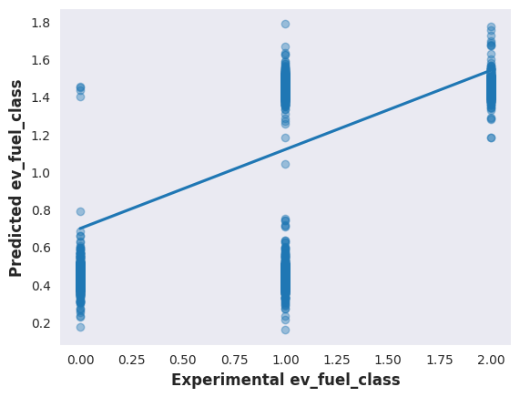
    


```python
import seaborn as sns
import matplotlib.pyplot as plt
data = [Y_test, predictions]
# Create a heatmap using seaborn
sns.heatmap(data)

# Display the plot
plt.show()

```


    
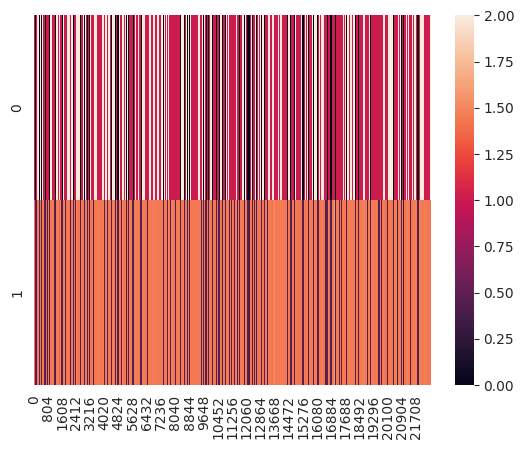
    


```python
import seaborn as sns
import matplotlib.pyplot as plt

# Create a bar plot using seaborn
sns.barplot(x=Y_test, y=predictions)

# Display the plot
plt.show()

```


    
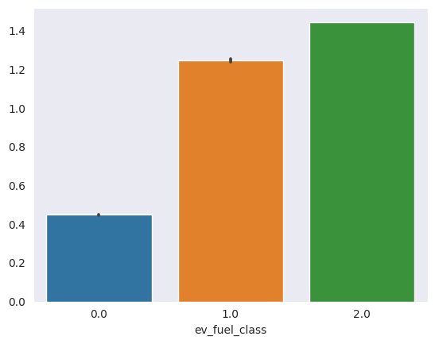
    


```python

```
